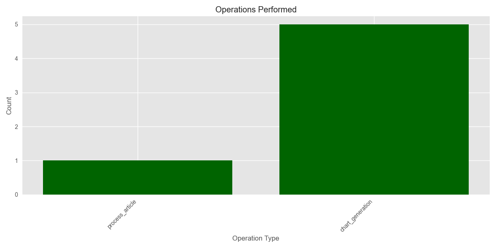

# Media Analysis Program Execution Summary

**Generated:** 2025-03-02 16:27:49

## Overview

* **Total Execution Time:** 2698.98 seconds (44.98 minutes)
* **Articles Processed:** 72
* **Charts Generated:** 5
* **Sentiment Analyses Performed:** 0
* **Entities Extracted:** 0 (Organizations: 0, People: 0)

## AI Model Usage

* **Total AI Chatbot Calls:** 1141
* **Total Input Tokens:** 1,716,096.2
* **Total Output Tokens:** 112,521
* **Total Tokens Processed:** 1,828,617.2

### Estimated API Costs

* **Estimated Total Cost:** $58.23
* **GPT-4 Series Models:** $58.23
* **GPT-3.5 Series Models:** $0.00

### Model-Specific Usage

| Model | Calls | Input Tokens | Output Tokens | Total Tokens |
|-------|-------|--------------|---------------|-------------|
| gpt-4o-mini | 1031 | 1,377,867 | 75,654 | 1,453,521 |
| chatgpt-4o-latest | 110 | 338,229.2 | 36,867 | 375,096.2 |

## Function Analysis

### Top 15 Functions by Chatbot Usage

| Function | Chatbot Calls |
|----------|---------------|
| analyze_entity_sentiment | 458 |
| process_stakeholder_info | 116 |
| translate_content | 88 |
| generate_issue_analysis_output | 84 |
| generate_topics_output | 62 |
| extract_categories | 59 |
| generate_analytics_output | 58 |
| generate_consolidated_stakeholder_analysis | 52 |
| filter_relevant_articles | 36 |
| extract_metadata | 30 |
| generate_insights_output | 29 |
| extract_organizations | 29 |
| extract_people | 29 |
| generate_markdown_report | 6 |
| generate_publication_timeline_section | 2 |

## Operations Analysis

## Operation Timeline

| Timestamp | Operation | Execution Time (s) |
|-----------|-----------|-------------------|
| 15:42:50 | process_article | 1.01 |
| 16:04:47 | chart_generation | 0.08 |
| 16:04:49 | chart_generation | 0.29 |
| 16:04:53 | chart_generation | 0.06 |
| 16:17:49 | chart_generation | 0.09 |
| 16:17:50 | chart_generation | 0.07 |

## Performance Analysis

### Average Response Times by Model

| Model | Average Response Time (s) |
|-------|--------------------------|
| chatgpt-4o-latest | 4.75 |
| gpt-4o-mini | 2.03 |

## Additional Notes

* This report provides a summary of the program execution metrics and resource usage.
* Token counts are estimated based on standard approximations.
* For detailed logs, refer to the tracker.log file in the ProgramSummaries directory.
* Estimated costs are based on approximate OpenAI pricing and may not reflect actual billing.
* Performance figures are measured on this specific run and may vary based on system load and network conditions.
