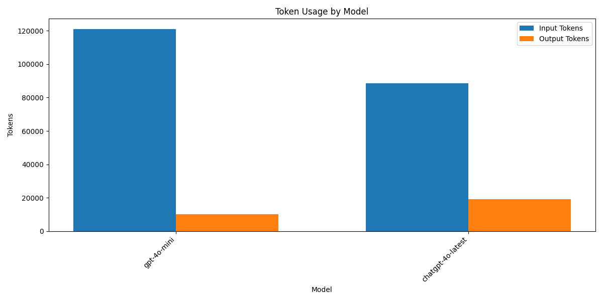
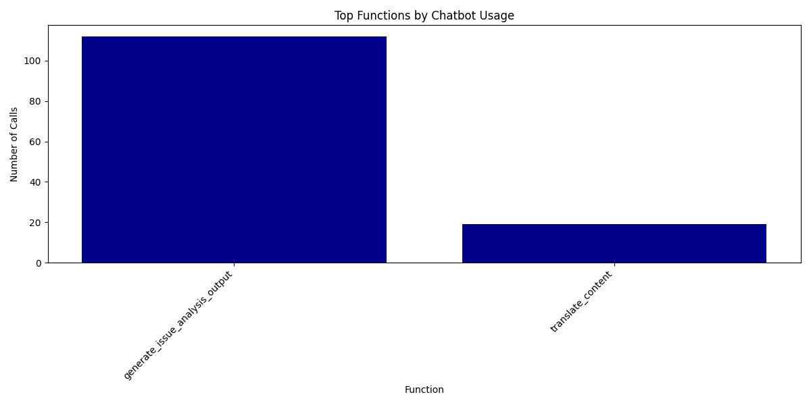
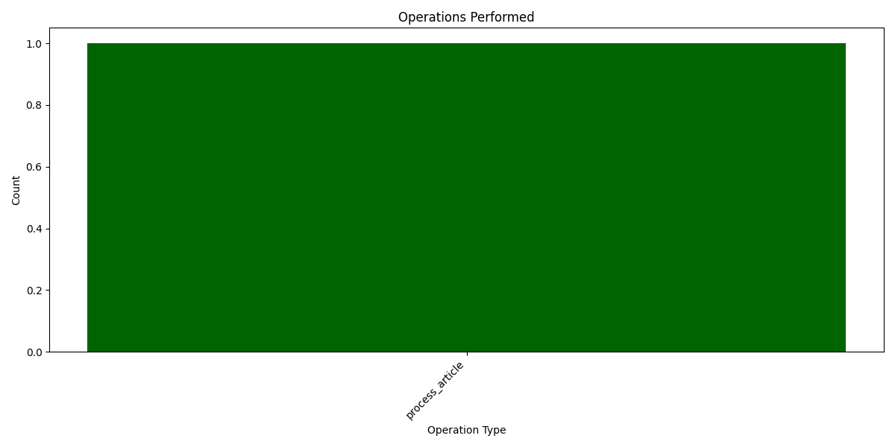

# Media Analysis Program Execution Summary

**Generated:** 2025-03-03 13:56:21

## Overview

* **Total Execution Time:** 489.71 seconds (8.16 minutes)
* **Articles Processed:** 72
* **Charts Generated:** 0
* **Sentiment Analyses Performed:** 0
* **Entities Extracted:** 0 (Organizations: 0, People: 0)

## AI Model Usage

* **Total AI Chatbot Calls:** 131
* **Total Input Tokens:** 209,587.2
* **Total Output Tokens:** 29,242
* **Total Tokens Processed:** 238,829.2

### Estimated API Costs

* **Estimated Total Cost:** $8.04
* **GPT-4 Series Models:** $8.04
* **GPT-3.5 Series Models:** $0.00

### Model-Specific Usage

| Model | Calls | Input Tokens | Output Tokens | Total Tokens |
|-------|-------|--------------|---------------|-------------|
| gpt-4o-mini | 120 | 121,106 | 10,024 | 131,130 |
| chatgpt-4o-latest | 11 | 88,481.2 | 19,218 | 107,699.2 |

## Function Analysis

### Top 15 Functions by Chatbot Usage

| Function | Chatbot Calls |
|----------|---------------|
| generate_issue_analysis_output | 112 |
| translate_content | 19 |

## Operations Analysis

## Operation Timeline

| Timestamp | Operation | Execution Time (s) |
|-----------|-----------|-------------------|
| 13:48:12 | process_article | 1.01 |

## Performance Analysis

### Average Response Times by Model

| Model | Average Response Time (s) |
|-------|--------------------------|
| chatgpt-4o-latest | 23.22 |
| gpt-4o-mini | 1.89 |

## Additional Notes

* This report provides a summary of the program execution metrics and resource usage.
* Token counts are estimated based on standard approximations.
* For detailed logs, refer to the tracker.log file in the ProgramSummaries directory.
* Estimated costs are based on approximate OpenAI pricing and may not reflect actual billing.
* Performance figures are measured on this specific run and may vary based on system load and network conditions.
