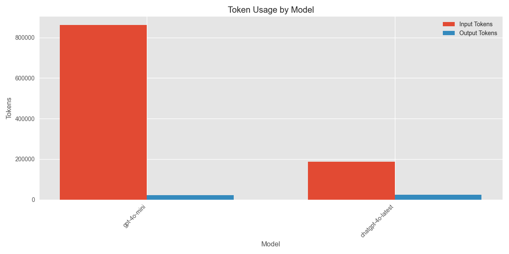
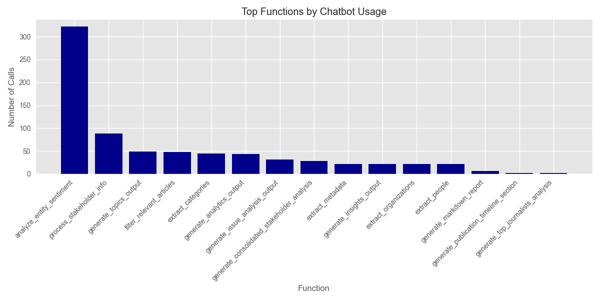

# Media Analysis Program Execution Summary

**Generated:** 2025-03-12 15:26:11

## Overview

* **Total Execution Time:** 1515.59 seconds (25.26 minutes)
* **Articles Processed:** 96
* **Charts Generated:** 5
* **Sentiment Analyses Performed:** 0
* **Entities Extracted:** 0 (Organizations: 0, People: 0)

## AI Model Usage

* **Total AI Chatbot Calls:** 755
* **Total Input Tokens:** 1,049,134.6
* **Total Output Tokens:** 46,951
* **Total Tokens Processed:** 1,096,085.6

### Estimated API Costs

* **Estimated Total Cost:** $34.29
* **GPT-4 Series Models:** $34.29
* **GPT-3.5 Series Models:** $0.00

### Model-Specific Usage

| Model | Calls | Input Tokens | Output Tokens | Total Tokens |
|-------|-------|--------------|---------------|-------------|
| gpt-4o-mini | 678 | 861,728 | 23,188 | 884,916 |
| chatgpt-4o-latest | 77 | 187,406.6 | 23,763 | 211,169.6 |

## Function Analysis

### Top 15 Functions by Chatbot Usage

| Function | Chatbot Calls |
|----------|---------------|
| analyze_entity_sentiment | 322 |
| process_stakeholder_info | 88 |
| generate_topics_output | 49 |
| filter_relevant_articles | 48 |
| extract_categories | 45 |
| generate_analytics_output | 44 |
| generate_issue_analysis_output | 32 |
| generate_consolidated_stakeholder_analysis | 28 |
| extract_metadata | 22 |
| generate_insights_output | 22 |
| extract_organizations | 22 |
| extract_people | 22 |
| generate_markdown_report | 6 |
| generate_publication_timeline_section | 2 |
| generate_top_journalists_analysis | 2 |

## Operations Analysis

## Operation Timeline

| Timestamp | Operation | Execution Time (s) |
|-----------|-----------|-------------------|
| 15:00:56 | process_article | 1.02 |
| 15:14:07 | chart_generation | 0.08 |
| 15:14:10 | chart_generation | 0.52 |
| 15:14:14 | chart_generation | 0.07 |
| 15:22:03 | chart_generation | 0.15 |
| 15:22:04 | chart_generation | 0.13 |

## Performance Analysis

### Average Response Times by Model

| Model | Average Response Time (s) |
|-------|--------------------------|
| chatgpt-4o-latest | 6.35 |
| gpt-4o-mini | 1.41 |

## Additional Notes

* This report provides a summary of the program execution metrics and resource usage.
* Token counts are estimated based on standard approximations.
* For detailed logs, refer to the tracker.log file in the ProgramSummaries directory.
* Estimated costs are based on approximate OpenAI pricing and may not reflect actual billing.
* Performance figures are measured on this specific run and may vary based on system load and network conditions.
