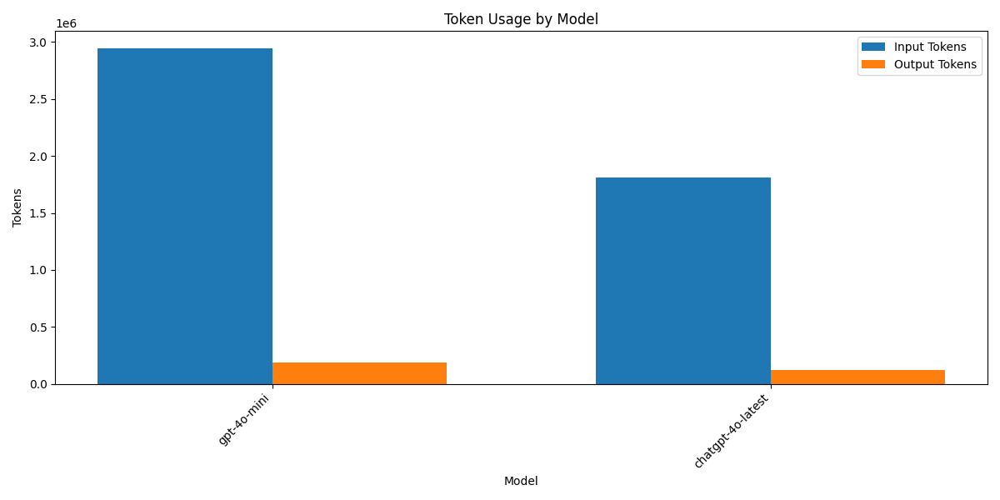
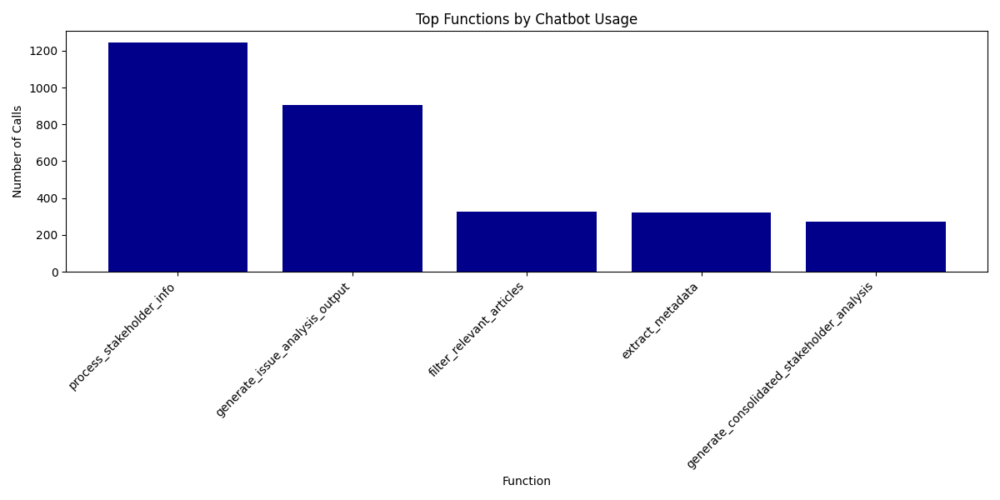
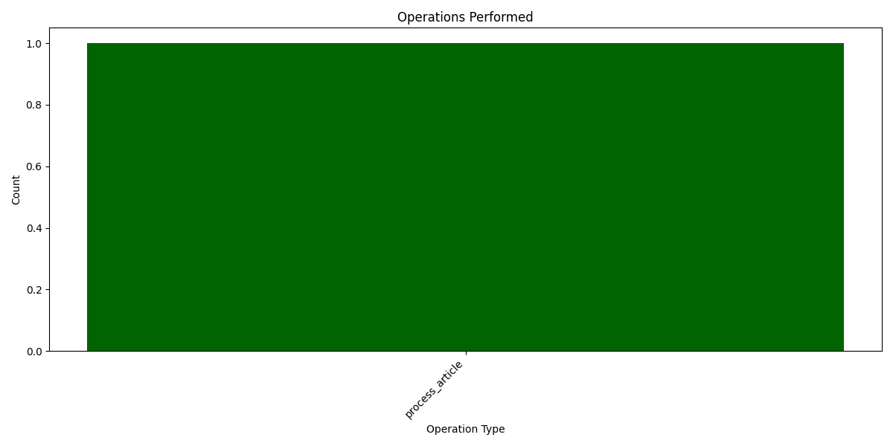

# Media Analysis Program Execution Summary

**Generated:** 2025-03-10 20:00:45

## Overview

* **Total Execution Time:** 7451.18 seconds (124.19 minutes)
* **Articles Processed:** 652
* **Charts Generated:** 0
* **Sentiment Analyses Performed:** 0
* **Entities Extracted:** 0 (Organizations: 0, People: 0)

## AI Model Usage

* **Total AI Chatbot Calls:** 3067
* **Total Input Tokens:** 4,757,318.2
* **Total Output Tokens:** 308,366
* **Total Tokens Processed:** 5,065,684.2

### Estimated API Costs

* **Estimated Total Cost:** $161.22
* **GPT-4 Series Models:** $161.22
* **GPT-3.5 Series Models:** $0.00

### Model-Specific Usage

| Model | Calls | Input Tokens | Output Tokens | Total Tokens |
|-------|-------|--------------|---------------|-------------|
| gpt-4o-mini | 2462 | 2,946,514 | 186,346 | 3,132,860 |
| chatgpt-4o-latest | 605 | 1,810,804.2 | 122,020 | 1,932,824.2 |

## Function Analysis

### Top 15 Functions by Chatbot Usage

| Function | Chatbot Calls |
|----------|---------------|
| process_stakeholder_info | 1244 |
| generate_issue_analysis_output | 904 |
| filter_relevant_articles | 326 |
| extract_metadata | 321 |
| generate_consolidated_stakeholder_analysis | 272 |

## Operations Analysis

## Operation Timeline

| Timestamp | Operation | Execution Time (s) |
|-----------|-----------|-------------------|
| 17:56:41 | process_article | 8.53 |

## Performance Analysis

### Average Response Times by Model

| Model | Average Response Time (s) |
|-------|--------------------------|
| chatgpt-4o-latest | 4.15 |
| gpt-4o-mini | 1.85 |

## Additional Notes

* This report provides a summary of the program execution metrics and resource usage.
* Token counts are estimated based on standard approximations.
* For detailed logs, refer to the tracker.log file in the ProgramSummaries directory.
* Estimated costs are based on approximate OpenAI pricing and may not reflect actual billing.
* Performance figures are measured on this specific run and may vary based on system load and network conditions.
