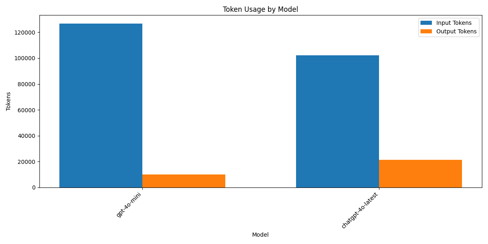
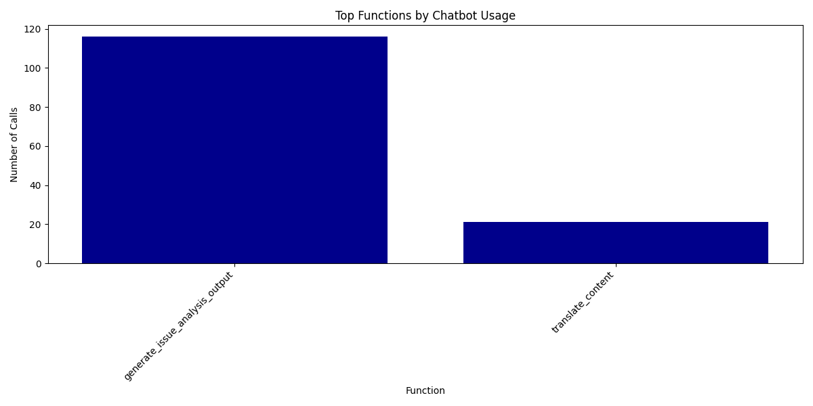

# Media Analysis Program Execution Summary

**Generated:** 2025-03-03 14:29:57

## Overview

* **Total Execution Time:** 629.17 seconds (10.49 minutes)
* **Articles Processed:** 72
* **Charts Generated:** 0
* **Sentiment Analyses Performed:** 0
* **Entities Extracted:** 0 (Organizations: 0, People: 0)

## AI Model Usage

* **Total AI Chatbot Calls:** 137
* **Total Input Tokens:** 229,153.2
* **Total Output Tokens:** 31,480
* **Total Tokens Processed:** 260,633.2

### Estimated API Costs

* **Estimated Total Cost:** $8.76
* **GPT-4 Series Models:** $8.76
* **GPT-3.5 Series Models:** $0.00

### Model-Specific Usage

| Model | Calls | Input Tokens | Output Tokens | Total Tokens |
|-------|-------|--------------|---------------|-------------|
| gpt-4o-mini | 125 | 126,886 | 10,176 | 137,062 |
| chatgpt-4o-latest | 12 | 102,267.2 | 21,304 | 123,571.2 |

## Function Analysis

### Top 15 Functions by Chatbot Usage

| Function | Chatbot Calls |
|----------|---------------|
| generate_issue_analysis_output | 116 |
| translate_content | 21 |

## Operations Analysis

## Operation Timeline

| Timestamp | Operation | Execution Time (s) |
|-----------|-----------|-------------------|
| 14:19:29 | process_article | 1.04 |

## Performance Analysis

### Average Response Times by Model

| Model | Average Response Time (s) |
|-------|--------------------------|
| chatgpt-4o-latest | 26.35 |
| gpt-4o-mini | 2.44 |

## Additional Notes

* This report provides a summary of the program execution metrics and resource usage.
* Token counts are estimated based on standard approximations.
* For detailed logs, refer to the tracker.log file in the ProgramSummaries directory.
* Estimated costs are based on approximate OpenAI pricing and may not reflect actual billing.
* Performance figures are measured on this specific run and may vary based on system load and network conditions.
