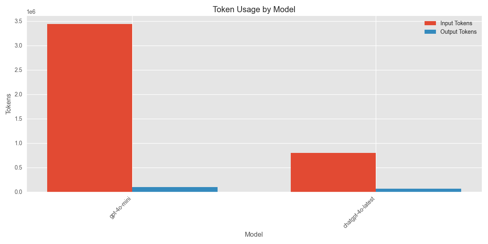

# Media Analysis Program Execution Summary

**Generated:** 2025-03-02 23:24:35

## Overview

* **Total Execution Time:** 4925.48 seconds (82.09 minutes)
* **Articles Processed:** 168
* **Charts Generated:** 5
* **Sentiment Analyses Performed:** 0
* **Entities Extracted:** 0 (Organizations: 0, People: 0)

## AI Model Usage

* **Total AI Chatbot Calls:** 2683
* **Total Input Tokens:** 4,237,969.0
* **Total Output Tokens:** 161,695
* **Total Tokens Processed:** 4,399,664.0

### Estimated API Costs

* **Estimated Total Cost:** $136.84
* **GPT-4 Series Models:** $136.84
* **GPT-3.5 Series Models:** $0.00

### Model-Specific Usage

| Model | Calls | Input Tokens | Output Tokens | Total Tokens |
|-------|-------|--------------|---------------|-------------|
| gpt-4o-mini | 2455 | 3,439,688 | 98,273 | 3,537,961 |
| chatgpt-4o-latest | 228 | 798,281.0 | 63,422 | 861,703.0 |

## Function Analysis

### Top 15 Functions by Chatbot Usage

| Function | Chatbot Calls |
|----------|---------------|
| analyze_entity_sentiment | 1212 |
| process_stakeholder_info | 328 |
| generate_topics_output | 172 |
| extract_categories | 165 |
| generate_analytics_output | 164 |
| generate_consolidated_stakeholder_analysis | 110 |
| generate_issue_analysis_output | 107 |
| filter_relevant_articles | 84 |
| extract_metadata | 82 |
| generate_insights_output | 82 |
| extract_organizations | 82 |
| extract_people | 82 |
| generate_markdown_report | 6 |
| generate_publication_timeline_section | 2 |
| generate_top_journalists_analysis | 2 |

## Operations Analysis

## Operation Timeline

| Timestamp | Operation | Execution Time (s) |
|-----------|-----------|-------------------|
| 22:02:31 | process_article | 2.62 |
| 22:37:28 | chart_generation | 0.12 |
| 22:37:31 | chart_generation | 0.31 |
| 22:37:35 | chart_generation | 0.10 |
| 23:08:21 | chart_generation | 0.09 |
| 23:08:22 | chart_generation | 0.08 |

## Performance Analysis

### Average Response Times by Model

| Model | Average Response Time (s) |
|-------|--------------------------|
| chatgpt-4o-latest | 4.09 |
| gpt-4o-mini | 1.55 |

## Additional Notes

* This report provides a summary of the program execution metrics and resource usage.
* Token counts are estimated based on standard approximations.
* For detailed logs, refer to the tracker.log file in the ProgramSummaries directory.
* Estimated costs are based on approximate OpenAI pricing and may not reflect actual billing.
* Performance figures are measured on this specific run and may vary based on system load and network conditions.
