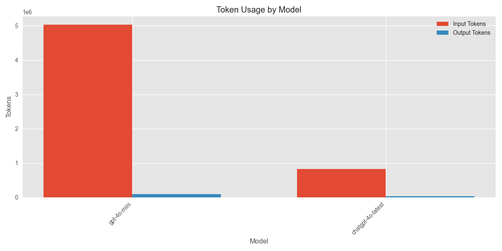
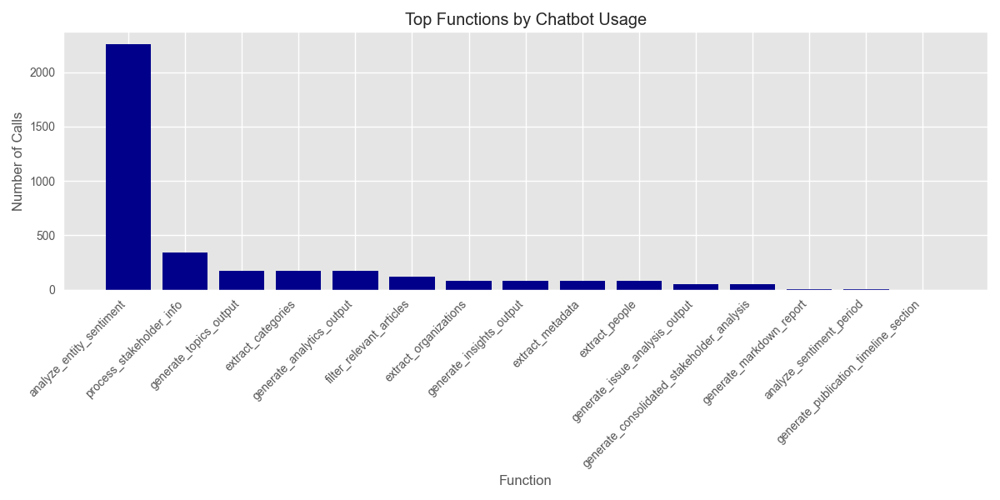

# Media Analysis Program Execution Summary

**Generated:** 2025-03-10 18:36:29

## Overview

* **Total Execution Time:** 5162.04 seconds (86.03 minutes)
* **Articles Processed:** 244
* **Charts Generated:** 5
* **Sentiment Analyses Performed:** 0
* **Entities Extracted:** 0 (Organizations: 0, People: 0)

## AI Model Usage

* **Total AI Chatbot Calls:** 3708
* **Total Input Tokens:** 5,856,632.8
* **Total Output Tokens:** 134,288
* **Total Tokens Processed:** 5,990,920.8

### Estimated API Costs

* **Estimated Total Cost:** $183.76
* **GPT-4 Series Models:** $183.76
* **GPT-3.5 Series Models:** $0.00

### Model-Specific Usage

| Model | Calls | Input Tokens | Output Tokens | Total Tokens |
|-------|-------|--------------|---------------|-------------|
| gpt-4o-mini | 3539 | 5,030,312 | 96,392 | 5,126,704 |
| chatgpt-4o-latest | 169 | 826,320.8 | 37,896 | 864,216.8 |

## Function Analysis

### Top 15 Functions by Chatbot Usage

| Function | Chatbot Calls |
|----------|---------------|
| analyze_entity_sentiment | 2256 |
| process_stakeholder_info | 344 |
| generate_topics_output | 178 |
| extract_categories | 173 |
| generate_analytics_output | 172 |
| filter_relevant_articles | 122 |
| extract_metadata | 86 |
| generate_insights_output | 86 |
| extract_organizations | 86 |
| extract_people | 86 |
| generate_issue_analysis_output | 55 |
| generate_consolidated_stakeholder_analysis | 50 |
| generate_markdown_report | 6 |
| analyze_sentiment_period | 3 |
| generate_publication_timeline_section | 2 |

## Operations Analysis

## Operation Timeline

| Timestamp | Operation | Execution Time (s) |
|-----------|-----------|-------------------|
| 17:10:30 | process_article | 3.46 |
| 17:39:34 | chart_generation | 0.08 |
| 17:39:36 | chart_generation | 0.23 |
| 17:39:40 | chart_generation | 0.06 |
| 18:25:00 | chart_generation | 0.10 |
| 18:25:01 | chart_generation | 0.08 |

## Performance Analysis

### Average Response Times by Model

| Model | Average Response Time (s) |
|-------|--------------------------|
| chatgpt-4o-latest | 4.32 |
| gpt-4o-mini | 1.19 |

## Additional Notes

* This report provides a summary of the program execution metrics and resource usage.
* Token counts are estimated based on standard approximations.
* For detailed logs, refer to the tracker.log file in the ProgramSummaries directory.
* Estimated costs are based on approximate OpenAI pricing and may not reflect actual billing.
* Performance figures are measured on this specific run and may vary based on system load and network conditions.
