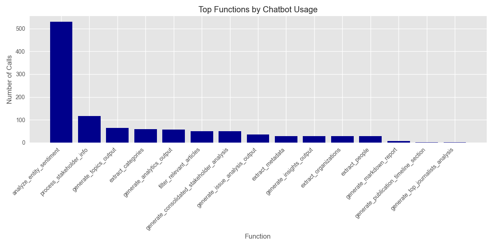

# Media Analysis Program Execution Summary

**Generated:** 2025-03-12 15:30:13

## Overview

* **Total Execution Time:** 2091.52 seconds (34.86 minutes)
* **Articles Processed:** 100
* **Charts Generated:** 5
* **Sentiment Analyses Performed:** 0
* **Entities Extracted:** 0 (Organizations: 0, People: 0)

## AI Model Usage

* **Total AI Chatbot Calls:** 1090
* **Total Input Tokens:** 1,761,657.4
* **Total Output Tokens:** 69,968
* **Total Tokens Processed:** 1,831,625.4

### Estimated API Costs

* **Estimated Total Cost:** $57.05
* **GPT-4 Series Models:** $57.05
* **GPT-3.5 Series Models:** $0.00

### Model-Specific Usage

| Model | Calls | Input Tokens | Output Tokens | Total Tokens |
|-------|-------|--------------|---------------|-------------|
| gpt-4o-mini | 981 | 1,443,004 | 37,126 | 1,480,130 |
| chatgpt-4o-latest | 109 | 318,653.4 | 32,842 | 351,495.4 |

## Function Analysis

### Top 15 Functions by Chatbot Usage

| Function | Chatbot Calls |
|----------|---------------|
| analyze_entity_sentiment | 530 |
| process_stakeholder_info | 116 |
| generate_topics_output | 65 |
| extract_categories | 59 |
| generate_analytics_output | 58 |
| filter_relevant_articles | 50 |
| generate_consolidated_stakeholder_analysis | 50 |
| generate_issue_analysis_output | 35 |
| extract_metadata | 29 |
| generate_insights_output | 29 |
| extract_organizations | 29 |
| extract_people | 29 |
| generate_markdown_report | 6 |
| generate_publication_timeline_section | 2 |
| generate_top_journalists_analysis | 2 |

## Operations Analysis

## Operation Timeline

| Timestamp | Operation | Execution Time (s) |
|-----------|-----------|-------------------|
| 14:55:22 | process_article | 1.35 |
| 15:09:54 | chart_generation | 0.11 |
| 15:09:57 | chart_generation | 0.29 |
| 15:10:01 | chart_generation | 0.12 |
| 15:23:42 | chart_generation | 0.10 |
| 15:23:43 | chart_generation | 0.10 |

## Performance Analysis

### Average Response Times by Model

| Model | Average Response Time (s) |
|-------|--------------------------|
| chatgpt-4o-latest | 4.70 |
| gpt-4o-mini | 1.53 |

## Additional Notes

* This report provides a summary of the program execution metrics and resource usage.
* Token counts are estimated based on standard approximations.
* For detailed logs, refer to the tracker.log file in the ProgramSummaries directory.
* Estimated costs are based on approximate OpenAI pricing and may not reflect actual billing.
* Performance figures are measured on this specific run and may vary based on system load and network conditions.
