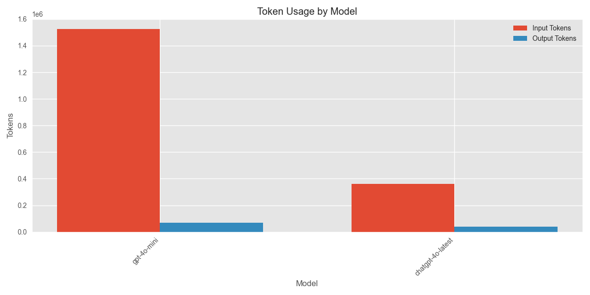
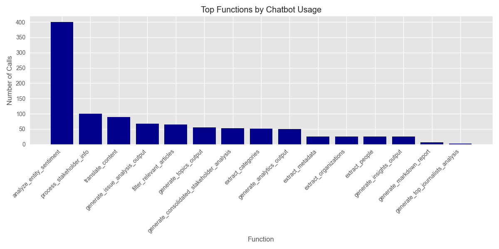
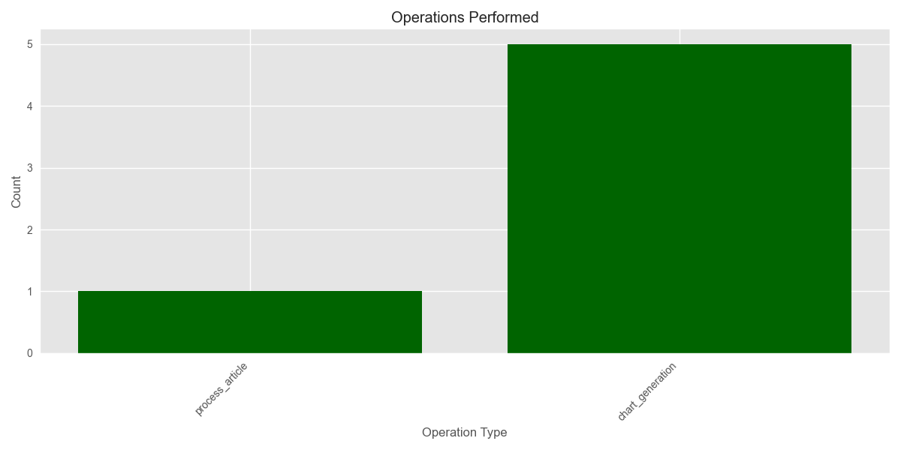

# Media Analysis Program Execution Summary

**Generated:** 2025-02-28 19:31:58

## Overview

* **Total Execution Time:** 2273.82 seconds (37.90 minutes)
* **Articles Processed:** 130
* **Charts Generated:** 5
* **Sentiment Analyses Performed:** 0
* **Entities Extracted:** 0 (Organizations: 0, People: 0)

## AI Model Usage

* **Total AI Chatbot Calls:** 1042
* **Total Input Tokens:** 1,886,931.4
* **Total Output Tokens:** 110,502
* **Total Tokens Processed:** 1,997,433.4

### Estimated API Costs

* **Estimated Total Cost:** $63.24
* **GPT-4 Series Models:** $63.24
* **GPT-3.5 Series Models:** $0.00

### Model-Specific Usage

| Model | Calls | Input Tokens | Output Tokens | Total Tokens |
|-------|-------|--------------|---------------|-------------|
| gpt-4o-mini | 934 | 1,525,455 | 70,769 | 1,596,224 |
| chatgpt-4o-latest | 108 | 361,476.4 | 39,733 | 401,209.4 |

## Function Analysis

### Top 15 Functions by Chatbot Usage

| Function | Chatbot Calls |
|----------|---------------|
| analyze_entity_sentiment | 400 |
| process_stakeholder_info | 100 |
| translate_content | 89 |
| generate_issue_analysis_output | 68 |
| filter_relevant_articles | 65 |
| generate_topics_output | 55 |
| generate_consolidated_stakeholder_analysis | 52 |
| extract_categories | 51 |
| generate_analytics_output | 50 |
| extract_metadata | 26 |
| generate_insights_output | 25 |
| extract_organizations | 25 |
| extract_people | 25 |
| generate_markdown_report | 6 |
| generate_publication_timeline_section | 2 |

## Operations Analysis

## Operation Timeline

| Timestamp | Operation | Execution Time (s) |
|-----------|-----------|-------------------|
| 18:54:05 | process_article | 1.96 |
| 19:14:17 | chart_generation | 0.11 |
| 19:14:19 | chart_generation | 0.32 |
| 19:14:25 | chart_generation | 0.12 |
| 19:24:06 | chart_generation | 0.13 |
| 19:24:07 | chart_generation | 0.12 |

## Performance Analysis

### Average Response Times by Model

| Model | Average Response Time (s) |
|-------|--------------------------|
| chatgpt-4o-latest | 4.59 |
| gpt-4o-mini | 1.82 |

## Additional Notes

* This report provides a summary of the program execution metrics and resource usage.
* Token counts are estimated based on standard approximations.
* For detailed logs, refer to the tracker.log file in the ProgramSummaries directory.
* Estimated costs are based on approximate OpenAI pricing and may not reflect actual billing.
* Performance figures are measured on this specific run and may vary based on system load and network conditions.
