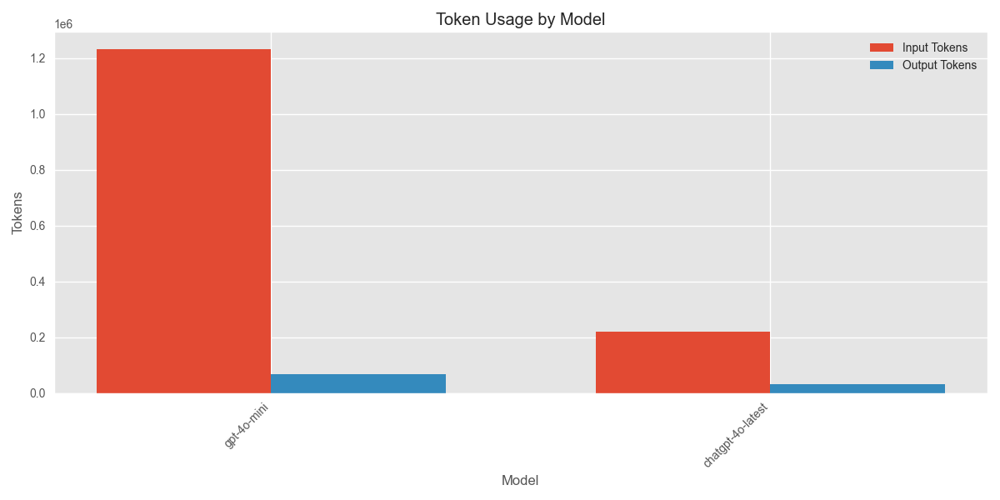
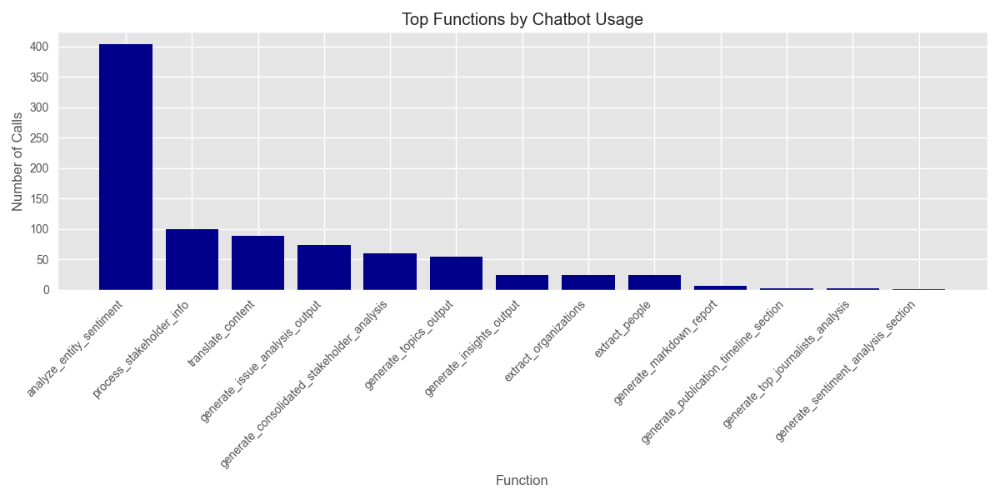
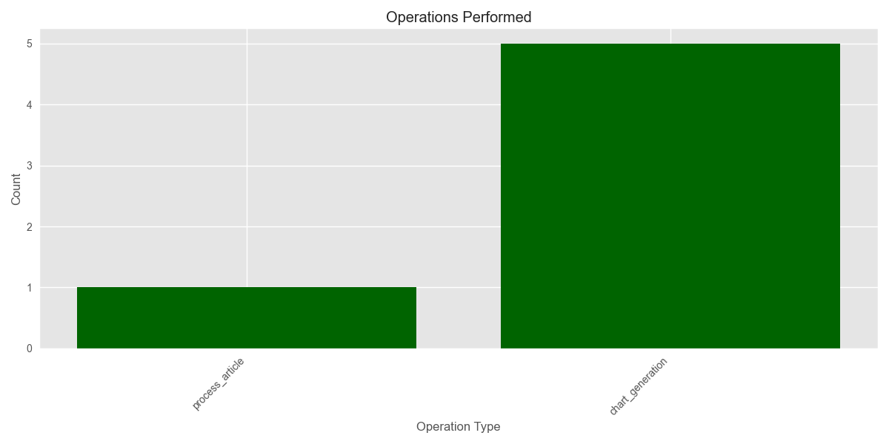

# Media Analysis Program Execution Summary

**Generated:** 2025-03-01 11:38:23

## Overview

* **Total Execution Time:** 2857.48 seconds (47.62 minutes)
* **Articles Processed:** 82
* **Charts Generated:** 5
* **Sentiment Analyses Performed:** 0
* **Entities Extracted:** 0 (Organizations: 0, People: 0)

## AI Model Usage

* **Total AI Chatbot Calls:** 868
* **Total Input Tokens:** 1,453,294.4
* **Total Output Tokens:** 99,266
* **Total Tokens Processed:** 1,552,560.4

### Estimated API Costs

* **Estimated Total Cost:** $49.55
* **GPT-4 Series Models:** $49.55
* **GPT-3.5 Series Models:** $0.00

### Model-Specific Usage

| Model | Calls | Input Tokens | Output Tokens | Total Tokens |
|-------|-------|--------------|---------------|-------------|
| gpt-4o-mini | 782 | 1,232,678 | 67,068 | 1,299,746 |
| chatgpt-4o-latest | 86 | 220,616.4 | 32,198 | 252,814.4 |

## Function Analysis

### Top 15 Functions by Chatbot Usage

| Function | Chatbot Calls |
|----------|---------------|
| analyze_entity_sentiment | 404 |
| process_stakeholder_info | 100 |
| translate_content | 89 |
| generate_issue_analysis_output | 74 |
| generate_consolidated_stakeholder_analysis | 60 |
| generate_topics_output | 55 |
| generate_insights_output | 25 |
| extract_organizations | 25 |
| extract_people | 25 |
| generate_markdown_report | 6 |
| generate_publication_timeline_section | 2 |
| generate_top_journalists_analysis | 2 |
| generate_sentiment_analysis_section | 1 |

## Operations Analysis

## Operation Timeline

| Timestamp | Operation | Execution Time (s) |
|-----------|-----------|-------------------|
| 10:50:46 | process_article | 1.13 |
| 11:07:45 | chart_generation | 0.24 |
| 11:07:47 | chart_generation | 0.70 |
| 11:07:57 | chart_generation | 0.10 |
| 11:18:46 | chart_generation | 0.15 |
| 11:18:47 | chart_generation | 0.10 |

## Performance Analysis

### Average Response Times by Model

| Model | Average Response Time (s) |
|-------|--------------------------|
| chatgpt-4o-latest | 11.59 |
| gpt-4o-mini | 2.29 |

## Additional Notes

* This report provides a summary of the program execution metrics and resource usage.
* Token counts are estimated based on standard approximations.
* For detailed logs, refer to the tracker.log file in the ProgramSummaries directory.
* Estimated costs are based on approximate OpenAI pricing and may not reflect actual billing.
* Performance figures are measured on this specific run and may vary based on system load and network conditions.
