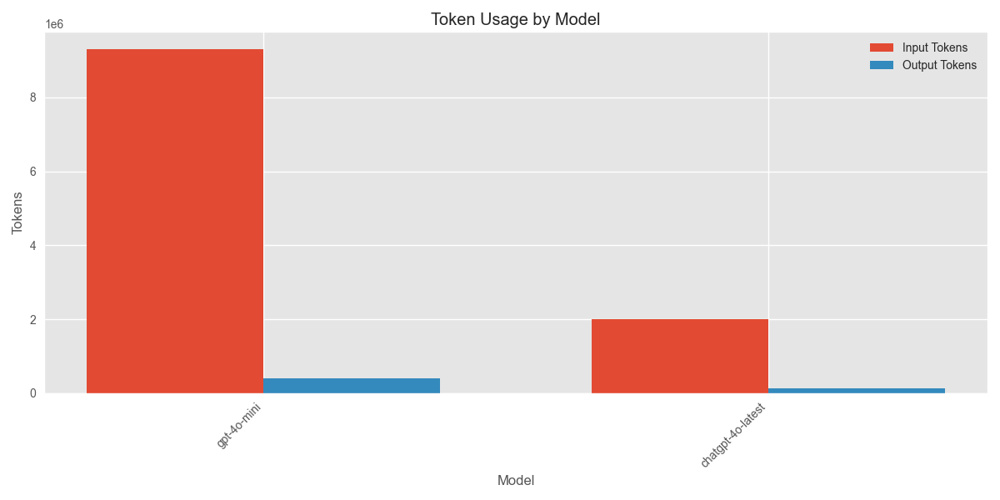
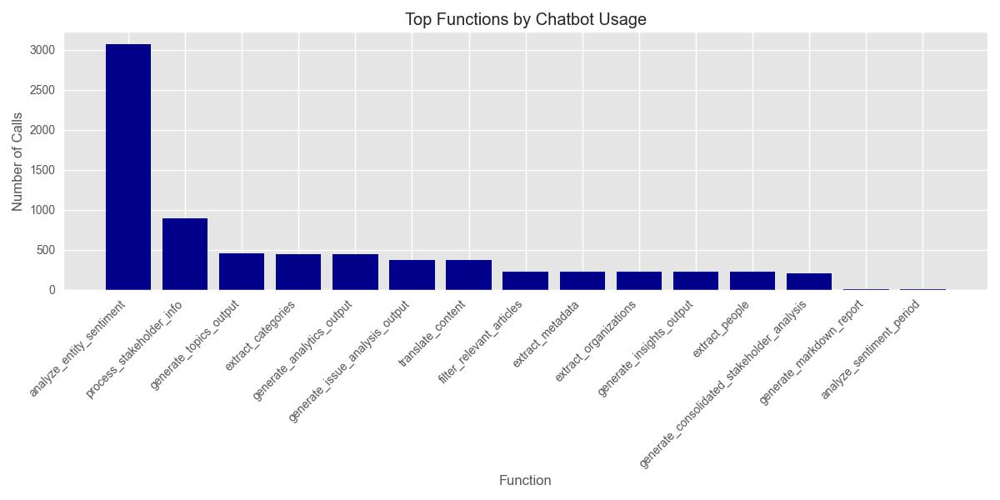

# Media Analysis Program Execution Summary

**Generated:** 2025-03-01 18:46:48

## Overview

* **Total Execution Time:** 16572.54 seconds (276.21 minutes)
* **Articles Processed:** 454
* **Charts Generated:** 5
* **Sentiment Analyses Performed:** 0
* **Entities Extracted:** 0 (Organizations: 0, People: 0)

## AI Model Usage

* **Total AI Chatbot Calls:** 7415
* **Total Input Tokens:** 11,315,364.8
* **Total Output Tokens:** 535,659
* **Total Tokens Processed:** 11,851,023.8

### Estimated API Costs

* **Estimated Total Cost:** $371.60
* **GPT-4 Series Models:** $371.60
* **GPT-3.5 Series Models:** $0.00

### Model-Specific Usage

| Model | Calls | Input Tokens | Output Tokens | Total Tokens |
|-------|-------|--------------|---------------|-------------|
| gpt-4o-mini | 6941 | 9,304,959 | 409,032 | 9,713,991 |
| chatgpt-4o-latest | 474 | 2,010,405.8 | 126,627 | 2,137,032.8 |

## Function Analysis

### Top 15 Functions by Chatbot Usage

| Function | Chatbot Calls |
|----------|---------------|
| analyze_entity_sentiment | 3072 |
| process_stakeholder_info | 896 |
| generate_topics_output | 456 |
| extract_categories | 449 |
| generate_analytics_output | 448 |
| generate_issue_analysis_output | 375 |
| translate_content | 368 |
| filter_relevant_articles | 227 |
| extract_metadata | 227 |
| generate_insights_output | 224 |
| extract_organizations | 224 |
| extract_people | 224 |
| generate_consolidated_stakeholder_analysis | 210 |
| generate_markdown_report | 6 |
| analyze_sentiment_period | 4 |

## Operations Analysis

## Operation Timeline

| Timestamp | Operation | Execution Time (s) |
|-----------|-----------|-------------------|
| 14:10:38 | process_article | 4.33 |
| 16:33:25 | chart_generation | 0.13 |
| 16:33:28 | chart_generation | 0.37 |
| 16:33:35 | chart_generation | 0.10 |
| 17:54:33 | chart_generation | 0.20 |
| 17:54:34 | chart_generation | 0.13 |

## Performance Analysis

### Average Response Times by Model

| Model | Average Response Time (s) |
|-------|--------------------------|
| chatgpt-4o-latest | 4.99 |
| gpt-4o-mini | 1.97 |

## Additional Notes

* This report provides a summary of the program execution metrics and resource usage.
* Token counts are estimated based on standard approximations.
* For detailed logs, refer to the tracker.log file in the ProgramSummaries directory.
* Estimated costs are based on approximate OpenAI pricing and may not reflect actual billing.
* Performance figures are measured on this specific run and may vary based on system load and network conditions.
