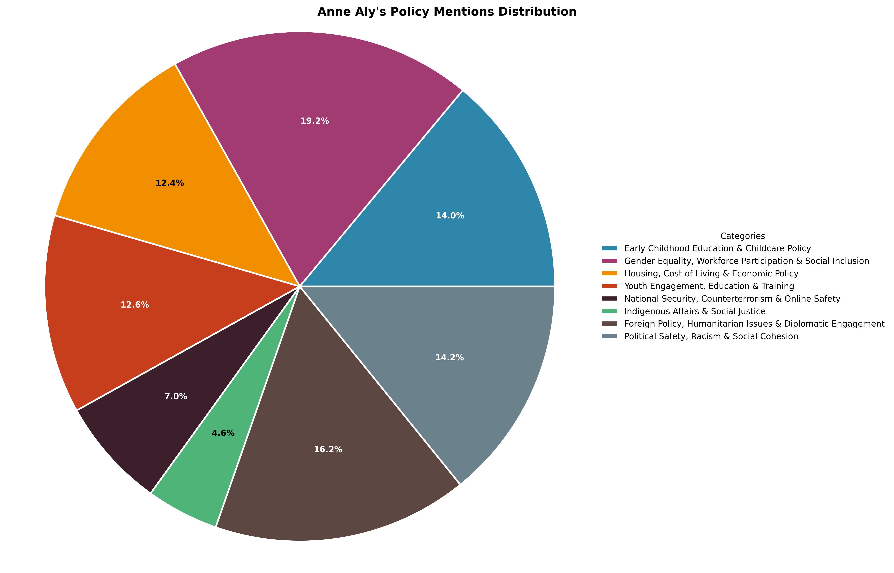

# Policy Position Analysis: Anne Aly

## Overview

### Introduction  

Dr. Anne Aly is an Australian politician and academic currently serving as the Minister for Early Childhood Education and Minister for Youth in the Albanese government. As a member of the Australian Labor Party (ALP) and the federal representative for the electorate of Cowan, Aly has been an influential voice on issues ranging from early childhood education to national security. Her background in counterterrorism research and advocacy for social inclusion has shaped her policy priorities, making an analysis of her positions essential for understanding her contributions to Australian public policy.  

This document provides a comprehensive analysis of Anne Aly’s policy positions across key areas, offering insights into her legislative focus and public advocacy. By examining media coverage and public statements, this analysis identifies trends in her policy engagement, highlighting her stance on early childhood education, gender equality, economic policy, youth engagement, national security, Indigenous affairs, foreign policy, and social cohesion. The methodology involves a quantitative and qualitative review of media mentions, categorizing policy discussions into thematic clusters to assess the emphasis and consistency of her positions. This approach ensures a balanced and evidence-based evaluation of Aly’s policy priorities and their broader implications.

## Policy Mentions Distribution

The following chart shows the distribution of Anne Aly's policy mentions across major policy areas:

## Table of Contents

1. [Early Childhood Education & Childcare Policy](#early-childhood-education-&-childcare-policy)
2. [Gender Equality, Workforce Participation & Social Inclusion](#gender-equality,-workforce-participation-&-social-inclusion)
3. [Housing, Cost of Living & Economic Policy](#housing,-cost-of-living-&-economic-policy)
4. [Youth Engagement, Education & Training](#youth-engagement,-education-&-training)
5. [National Security, Counterterrorism & Online Safety](#national-security,-counterterrorism-&-online-safety)
6. [Indigenous Affairs & Social Justice](#indigenous-affairs-&-social-justice)
7. [Foreign Policy, Humanitarian Issues & Diplomatic Engagement](#foreign-policy,-humanitarian-issues-&-diplomatic-engagement)
8. [Political Safety, Racism & Social Cohesion](#political-safety,-racism-&-social-cohesion)

---

## 1. Early Childhood Education & Childcare Policy

### Overview
This cluster encompasses policies related to early childhood education and childcare, focusing on affordability, accessibility, workforce conditions, and government oversight. It includes efforts to increase childcare subsidies, explore universal early childhood education, and improve workforce training and retention. Policies also address wage increases for educators, industrial action, and concerns about market regulation and price gouging. Additionally, it covers government transparency in childcare funding, particularly for children with disabilities, and Anne Aly’s ministerial role in shaping these policies. 

**Media Coverage**: 70 related mentions of positions/statements identified

### Positions and Statements
Anne Aly has consistently advocated for making early childhood education and childcare more affordable, accessible, and sustainable, emphasizing its role in economic growth, gender equality, and workforce participation. As Minister for Early Childhood Education and Youth, she has championed policies such as increasing the **Child Care Subsidy to 90% for low-income families**, expanding **fee-free TAFE places** to address workforce shortages, and supporting **multi-employer bargaining** to improve wages and conditions for early childhood educators <a href="#ref-1,2" style="text-decoration: none;">[1,2]</a>. She has also overseen **Productivity Commission and ACCC reviews** into childcare affordability and market regulation, acknowledging that the current system is unsustainable and requires significant reform <a href="#ref-3" style="text-decoration: none;">[3]</a>. 

Aly’s stance has remained consistent in prioritizing affordability and workforce sustainability, but her rhetoric has evolved to emphasize **universal early childhood education** as a long-term goal. She has framed childcare as an essential public good rather than a market-driven service, arguing that **providers often establish services based on profitability rather than demand** <a href="#ref-2" style="text-decoration: none;">[2]</a>. Additionally, she has highlighted the **importance of lived experience in shaping policy**, referencing her own reliance on childcare to escape poverty and pursue higher education <a href="#ref-4" style="text-decoration: none;">[4]</a>. Media coverage has generally framed her as a strong advocate for reform, though some outlets have highlighted tensions between government policies and sector demands, particularly regarding wage increases and workforce retention <a href="#ref-5" style="text-decoration: none;">[5]</a>. Overall, Aly’s approach reflects a commitment to structural reform, balancing immediate affordability measures with long-term system-wide changes.

## 2. Gender Equality, Workforce Participation & Social Inclusion

### Overview
This cluster focuses on policies that promote gender equality, workforce participation, and social inclusion. It includes efforts to close the gender pay gap through childcare policies that enable women to remain in the workforce. It also covers gender representation in politics, addressing workplace misogyny and advocating for greater diversity in government. Anne Aly’s role as the first Muslim woman in Parliament and later as a minister is highlighted, along with broader discussions on the representation of Muslim Australians in politics and public life. 

**Media Coverage**: 96 related mentions of positions/statements identified

### Positions and Statements
Anne Aly has consistently championed gender equality, workforce participation, and social inclusion, with a strong emphasis on early childhood education as a key driver of economic empowerment for women. She has repeatedly linked affordable childcare to increased workforce participation, particularly for women who are primary caregivers, and has advocated for government reforms to address workforce shortages in the early childhood education sector <a href="#ref-6,1" style="text-decoration: none;">[6,1]</a>. Aly has also framed universal childcare as an investment in both gender equality and economic growth, reinforcing the Albanese government’s broader policy agenda <a href="#ref-4" style="text-decoration: none;">[4]</a>. Additionally, she has supported wage increases for early childhood educators, recognizing the sector’s gendered nature and the need for fair pay to ensure sustainability <a href="#ref-7" style="text-decoration: none;">[7]</a>.

Beyond workforce participation, Aly has been a vocal advocate for diversity and inclusion in government, frequently highlighting her historic role as the first Muslim woman elected to federal parliament. She has spoken about the significance of representation, particularly for women and minorities, and has acknowledged the challenges she has faced, including racism and misogyny in politics <a href="#ref-8,9" style="text-decoration: none;">[8,9]</a>. Her stance on social inclusion extends to addressing discrimination, as seen in her condemnation of rising Islamophobia and antisemitism in Australia, reaffirming her commitment to community engagement despite facing hostility <a href="#ref-10" style="text-decoration: none;">[10]</a>. 

Over time, Aly’s position has remained consistent, with a clear focus on structural reforms to support gender equality in the workforce and broader social inclusion. Media coverage has largely framed her as a progressive advocate for these issues, often emphasizing her lived experience as a Muslim woman in politics. Outlets such as *Vogue Australia* and *AFR Online* have highlighted her role in breaking barriers, while mainstream news sources like *The Age* and *ABC* have reported on her policy initiatives and responses to discrimination. This framing reinforces her position as both a policymaker and a symbol of representation, aligning her advocacy with broader national conversations on gender and diversity.

## 3. Housing, Cost of Living & Economic Policy

### Overview
This cluster addresses economic policies aimed at improving affordability and financial security for Australians. It includes initiatives to increase the supply of affordable housing, social housing, and emergency housing for vulnerable groups. Cost-of-living relief measures, such as responsible budgeting and inflation control, are also covered. Additionally, policies related to vocational education and workforce development, including Fee-Free TAFE and the National Skills Agreement, are included as they contribute to economic stability and job opportunities. 

**Media Coverage**: 62 related mentions of positions/statements identified

### Positions and Statements
Anne Aly's stance on Housing, Cost of Living, and Economic Policy primarily focuses on addressing financial pressures faced by young people, students, and families, particularly through government intervention in education, childcare, and workforce development. As Minister for Youth, she has emphasized the need for a whole-of-government approach to tackling intergenerational wealth transfer, housing access, and cost-of-living challenges <a href="#ref-11" style="text-decoration: none;">[11]</a>. Her advocacy for fee-free TAFE and vocational training highlights her commitment to economic stability and job creation, with her support for the National Skills Agreement and workforce development initiatives aimed at addressing skill shortages and improving employment opportunities <a href="#ref-12" style="text-decoration: none;">[12]</a>. Additionally, she has acknowledged the financial burden on students, noting that Australia is one of the most expensive places to study, both in terms of tuition and living costs <a href="#ref-13" style="text-decoration: none;">[13]</a>.

Aly has also been vocal about childcare affordability, recognizing the high costs of early childhood education and the market’s failure to prioritize accessibility over profit <a href="#ref-14" style="text-decoration: none;">[14]</a>. She has supported government efforts to increase childcare subsidies, arguing that these measures will provide cost-of-living relief to over a million families, though she has acknowledged the challenges of implementing these changes more rapidly <a href="#ref-15" style="text-decoration: none;">[15]</a>. While her positions on housing affordability are less explicitly detailed, her broader economic policy approach suggests a focus on systemic reforms to improve financial security for vulnerable groups. Media coverage generally frames her as an advocate for affordability and accessibility, often highlighting her lived experience with financial hardship as a driving force behind her policy priorities. However, there is limited evidence of direct policy proposals on housing affordability beyond her broader economic and social initiatives.

## 4. Youth Engagement, Education & Training

### Overview
This cluster focuses on policies aimed at supporting young Australians through education, training, and economic opportunities. It includes efforts to reduce the cost of education, improve access to vocational training, and engage young people in policy discussions. The role of government in addressing youth employment, housing, and cost-of-living challenges is also covered. Additionally, discussions on the educational backgrounds of politicians and their representation in government are included. 

**Media Coverage**: 63 related mentions of positions/statements identified

### Positions and Statements
Anne Aly's stance on Youth Engagement, Education, and Training is centered on improving access to affordable education, particularly early childhood education and vocational training, while addressing broader economic challenges faced by young Australians. She has consistently emphasized the transformative impact of early childhood education in reducing disadvantage and enabling workforce participation, particularly for women. Her advocacy for fee-free TAFE and increased university spots aligns with her broader goal of making education more accessible and addressing workforce shortages in critical sectors <a href="#ref-16" style="text-decoration: none;">[16]</a>. Additionally, she has highlighted the high cost of studying in Australia, not just in terms of tuition but also the cost of living, positioning affordability as a key barrier to youth participation in education and training <a href="#ref-13" style="text-decoration: none;">[13]</a>.  

Aly has also been vocal about the need for a comprehensive youth engagement strategy, criticizing the previous government for neglecting this area and describing Labor’s approach as an opportunity to fill a "policy void" <a href="#ref-13" style="text-decoration: none;">[13]</a>. Her proposed strategy aims to address intergenerational wealth transfer, housing access, and cost-of-living pressures, reflecting a holistic approach to youth policy beyond education alone <a href="#ref-4" style="text-decoration: none;">[4]</a>. Over time, her focus has remained consistent, with an increasing emphasis on structural reforms such as multi-employer bargaining and gender pay gap reduction to support the early childhood education workforce <a href="#ref-1" style="text-decoration: none;">[1]</a>. Media coverage of her positions has largely framed her as a proactive policymaker, with outlets like the *Australian Financial Review* highlighting her personal educational achievements as a testament to her commitment to education reform <a href="#ref-17" style="text-decoration: none;">[17]</a>. However, some reports also underscore the challenges of implementing these reforms, particularly in balancing affordability with market-driven childcare costs <a href="#ref-2" style="text-decoration: none;">[2]</a>.

## 5. National Security, Counterterrorism & Online Safety

### Overview
This cluster covers policies related to national security, counterterrorism, and online safety. It includes concerns about foreign surveillance, cybersecurity, and efforts to counter violent extremism. Policies addressing misinformation, disinformation, and online harassment, including anti-doxing laws, are also included. Anne Aly’s expertise in counterterrorism and her contributions to online safety regulations are key aspects of this cluster. 

**Media Coverage**: 35 related mentions of positions/statements identified

### Positions and Statements
Anne Aly's stance on national security, counterterrorism, and online safety is shaped by her extensive background as a counterterrorism expert and academic. She has consistently emphasized the importance of countering online extremism, highlighting her international recognition, including invitations to speak at Oxford University and the White House <a href="#ref-18" style="text-decoration: none;">[18]</a>. Her expertise in this field has also led to personal security threats, necessitating the relocation of her research team to undisclosed locations for safety reasons <a href="#ref-9" style="text-decoration: none;">[9]</a>. This underscores her deep engagement with the risks posed by violent extremism and her commitment to addressing them through policy and public discourse.

Aly has also been a strong advocate for online safety, particularly in combating doxing and hate speech. She has supported the Federal Government’s introduction of anti-doxing laws, arguing that the malicious release of personal information poses a significant threat to Australian citizens <a href="#ref-19" style="text-decoration: none;">[19]</a>. Additionally, she has spoken out against rising hate speech, particularly in the context of tensions between Jewish and Islamic communities, reaffirming her commitment to community engagement despite facing hostility <a href="#ref-10" style="text-decoration: none;">[10]</a>. Her positions reflect a consistent focus on protecting individuals from online harm while addressing broader security concerns. Media coverage has largely framed her as a knowledgeable and authoritative voice on these issues, often emphasizing her academic credentials and personal experiences with security threats <a href="#ref-2" style="text-decoration: none;">[2]</a>. This portrayal reinforces her credibility but also highlights the personal risks she has faced in advocating for stronger counterterrorism and online safety measures.

## 6. Indigenous Affairs & Social Justice

### Overview
This cluster focuses on policies related to Indigenous rights, recognition, and social justice. It includes the proposed constitutional recognition of Aboriginal and Torres Strait Islander peoples and the establishment of a Voice to Parliament. Policies addressing systemic inequalities, Indigenous deaths in custody, and youth justice issues, including solitary confinement, are also covered. The government’s broader efforts to close the gap in health, education, and economic outcomes for Indigenous Australians are key components of this cluster. 

**Media Coverage**: 23 related mentions of positions/statements identified

### Positions and Statements
Anne Aly's stance on Indigenous Affairs & Social Justice appears to align with the broader government position, emphasizing consultation with Indigenous communities and a commitment to closing the gap in health, education, and economic outcomes. While she has not made extensive public statements on this policy area, she has acknowledged the importance of Indigenous recognition and the need for continued efforts despite the failure of the Voice referendum. Aly has stressed that Australians still want to see progress in Indigenous affairs and that the government remains committed to working in key areas such as health and life expectancy while ensuring Indigenous voices are heard in policymaking <a href="#ref-20" style="text-decoration: none;">[20]</a>.  

A key theme in Aly’s approach is the emphasis on local engagement rather than top-down decision-making from Canberra. She has highlighted the necessity of consulting Indigenous communities to develop effective policies, reinforcing the idea that solutions should be community-driven rather than imposed by the federal government <a href="#ref-20" style="text-decoration: none;">[20]</a>. However, her lack of direct response to questions about the unlawful use of solitary confinement for Indigenous youth in detention suggests a reluctance to engage in more contentious aspects of Indigenous justice, deferring instead to state governments, as echoed by Prime Minister Anthony Albanese <a href="#ref-20" style="text-decoration: none;">[20]</a>. Media coverage of her position has largely been indirect, with her views often presented within the context of broader government discussions rather than as standalone statements, indicating that Indigenous Affairs & Social Justice may not be a primary focus of her public advocacy.

## 7. Foreign Policy, Humanitarian Issues & Diplomatic Engagement

### Overview
This cluster covers Australia’s foreign policy, diplomatic relations, and humanitarian efforts. It includes trade relations with China, support for Ukraine in response to Russia’s invasion, and accountability for the MH17 tragedy. A significant portion of this cluster focuses on the Israel-Palestine conflict, including Anne Aly’s statements on humanitarian concerns, war crimes accountability, and diplomatic engagement. Australia’s role in providing humanitarian assistance to Gaza and broader foreign policy considerations are also included. 

**Media Coverage**: 81 related mentions of positions/statements identified

### Positions and Statements
Anne Aly's stance on foreign policy, humanitarian issues, and diplomatic engagement is primarily shaped by her strong advocacy for humanitarian assistance and accountability in the Israel-Palestine conflict. She has consistently raised concerns about the collective punishment of Palestinian civilians in Gaza, aligning with fellow Labor members such as Ed Husic in criticizing Israel’s military actions and blockade <a href="#ref-21,22" style="text-decoration: none;">[21,22]</a>. Aly has also called for investigations into alleged war crimes committed in Gaza, emphasizing that all parties should be held accountable under international law <a href="#ref-21" style="text-decoration: none;">[21]</a>. Her commitment to humanitarian aid is evident in her announcement of an additional $10 million in assistance for Gaza, directed to the World Food Programme, and her participation in international conferences advocating for increased aid and a ceasefire <a href="#ref-23,24" style="text-decoration: none;">[23,24]</a>.  

Aly’s position reflects a balance between advocating for Palestinian rights and maintaining her role within the government. While she has been vocal in criticizing Israel’s actions, she has also distanced herself from more radical positions, such as refusing to sign a pro-Palestinian petition that accused Israel of apartheid, citing her role in the government executive <a href="#ref-25" style="text-decoration: none;">[25]</a>. She has also questioned the effectiveness of symbolic political gestures, such as Senator Fatima Payman’s decision to cross the floor in support of Palestinian statehood, arguing that diplomatic efforts are more impactful <a href="#ref-26" style="text-decoration: none;">[26]</a>. However, her stance has led to political backlash, including confrontations with pro-Palestinian activists and criticism from opposition parties, highlighting the divisive nature of the issue within Australian politics <a href="#ref-27,28" style="text-decoration: none;">[27,28]</a>. Media coverage of Aly’s position has largely framed her as a key voice within Labor’s internal debate on the Israel-Palestine conflict, with some outlets emphasizing her humanitarian concerns while others highlight the political tensions her statements have generated.

## 8. Political Safety, Racism & Social Cohesion

### Overview
This cluster addresses issues related to political safety, racism, and social cohesion. It includes concerns about the harassment and security of politicians, particularly in the context of public confrontations. Policies aimed at combating racism, Islamophobia, and antisemitism are also covered. Anne Aly’s experiences with anti-Muslim racism and her advocacy for social cohesion and inclusivity in Australian society are key aspects of this cluster.  This clustering ensures that all 104 policy areas are assigned to exactly one category while maintaining meaningful and balanced groupings. Let me know if you need any refinements!

**Media Coverage**: 71 related mentions of positions/statements identified

### Positions and Statements
Anne Aly's stance on **Political Safety, Racism & Social Cohesion** is shaped by her personal experiences with racism, anti-Muslim sentiment, and threats to public figures, as well as her broader advocacy for inclusivity and social cohesion. She has consistently condemned public harassment and intimidation, reaffirming her commitment to engaging with her community despite facing hostility, particularly in the context of the Israel-Gaza conflict <a href="#ref-10" style="text-decoration: none;">[10]</a>. Aly has also highlighted the disproportionate scrutiny faced by Muslim politicians, especially Muslim women, noting the additional pressures and expectations placed on them <a href="#ref-28" style="text-decoration: none;">[28]</a>. Her support for the Federal Government’s introduction of laws criminalizing doxing underscores her focus on public safety, emphasizing the dangers of releasing personal information to incite harm <a href="#ref-29" style="text-decoration: none;">[29]</a>.  

Aly’s position reflects a strong commitment to combating racism and fostering social cohesion, as seen in her reflections on historical moments of unity and division in Australia, such as the 9/11 attacks and the same-sex marriage plebiscite <a href="#ref-2" style="text-decoration: none;">[2]</a>. She has also framed her political engagement as a response to rising anti-Muslim sentiment and personal threats, recounting how her work in counterterrorism led to death threats and forced relocations for security reasons <a href="#ref-9" style="text-decoration: none;">[9]</a>. While she has been vocal about the humanitarian impact of the Israel-Gaza conflict, calling for compassion and recognition of shared humanity <a href="#ref-2" style="text-decoration: none;">[2]</a>, her comments have also drawn criticism and accusations of division within the Albanese government <a href="#ref-21" style="text-decoration: none;">[21]</a>. Media coverage of her stance varies, with some outlets emphasizing her advocacy for inclusivity and public safety, while others highlight the political tensions surrounding her statements on international conflicts.

## Conclusion

Anne Aly's policy focus, as reflected in media coverage, centers on gender equality, workforce participation, and social inclusion, alongside foreign policy, humanitarian issues, and diplomatic engagement. Additionally, her contributions to political safety, racism, and social cohesion highlight a commitment to fostering a more inclusive and secure society. These areas suggest a strong emphasis on social equity, international cooperation, and community resilience, positioning her as an advocate for both domestic and global social justice initiatives.  

A key pattern across these policy areas is Aly’s consistent focus on inclusivity and security, whether in the context of gender equality, international relations, or social cohesion. Her approach suggests a belief in proactive policy measures to address systemic inequalities and enhance societal stability. Understanding these priorities provides valuable insight into her broader political stance, which appears to balance social progress with national and international security considerations. For stakeholders and the public, this analysis offers a clearer perspective on Aly’s policy direction, helping to inform engagement strategies, policy discussions, and electoral decisions.

---

## References

1. The Age, October 24, 2022

2. Australian Financial Review, November 25, 2023

3. The Age, February 16, 2023

4. AFR Online, June 8, 2022

5. Newcastle Herald, May 12, 2023

6. States News Service, February 8, 2023

7. The World Today (ABC transcript), August 8, 2024

8. Vogue Australia, August 22, 2022

9. Unknown, November 26, 2023

10. The Age, March 20, 2024

11. AFR Online, Julie Hare, June 8, 2022

12. States News Service, October 20, 2023

13. Unknown, June 11, 2022

14. Australian Financial Review, Julie Hare, November 25, 2023

15. The Age, Katina Curtis, June 13, 2022

16. States News Service, March 24, 2023

17. AFR Online, November 24, 2023

18. Unknown, November 27, 2023

19. Unknown, September 12, 2024

20. Unknown, October 20, 2023

21. The Guardian, October 19, 2023

22. Canberra Times, October 21, 2023

23. States News Service, June 12, 2024

24. International Business Times Australia, June 10, 2024

25. AFR Online, December 19, 2023

26. The Age, June 27, 2024

27. Wish Magazine Online, March 19, 2024

28. The Age, March 22, 2024

29. ABC News, September 12, 2024

