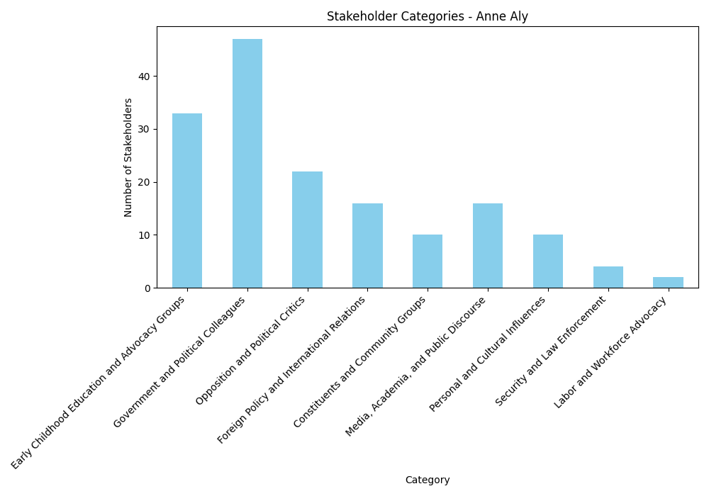

# Stakeholder Analysis for Anne Aly

## Overview

This report provides a comprehensive analysis of stakeholders related to Anne Aly based on media coverage. The analysis identifies key individuals and organizations, categorizes them based on their relationship with Anne Aly, and provides strategic insights for each stakeholder group.

## Summary Statistics

- **Total Stakeholders Identified**: 160
- **Organizations**: 60
- **Individuals**: 100
- **Stakeholder Categories**: 9

## Stakeholder Distribution by Category

## Category Analysis

This section provides a detailed analysis of each stakeholder category, including power-interest mapping, network analysis, and political impact assessment.

### Government and Political Colleagues

This category includes individuals and organizations within the Australian government and political landscape who collaborate with Anne Aly on policy initiatives, governance, and legislative matters.These stakeholders influence Anne Aly's ability to implement policies, secure funding, and navigate political challenges. Their support or opposition can impact her effectiveness as a minister and her standing within the Labor Party.

### Power-Interest Analysis

| **Stakeholder** | **Power** | **Interest** | **Basis for Assessment** |
|---------------|---------|---------|----------------------|
| **Anthony Albanese (Prime Minister)** | High | High | As the head of government, he has significant influence over policy direction and funding, directly impacting Anne Aly’s initiatives. |
| **Jason Clare (Minister for Education)** | High | High | Directly collaborates with Anne Aly on education policies, making him a key partner in policy implementation. |
| **Jim Chalmers (Treasurer)** | High | High | Controls budget allocations, which affect funding for early childhood education initiatives. |
| **Labor Party** | High | High | Provides political backing and policy direction for Anne Aly’s initiatives. |
| **Albanese Government** | High | High | The governing body that sets the overall policy agenda, influencing Anne Aly’s work. |
| **Productivity Commission** | High | Medium | Provides research and recommendations that shape early childhood education policies. |
| **ACCC (Australian Competition and Consumer Commission)** | High | Medium | Investigates the childcare sector, impacting Anne Aly’s policy decisions. |
| **Department of Education** | High | High | Administers education policies and funding, directly affecting Anne Aly’s portfolio. |
| **Ed Husic, Maria Vamvakinou, Fatima Payman, Julian Hill (Labor MPs/Senators)** | Medium | High | Share similar political stances with Anne Aly, particularly on international issues like the Israel-Palestine conflict. |
| **Adam Bandt & The Greens** | Medium | High | Support Anne Aly’s stance on Gaza, potentially influencing Labor’s position. |
| **Independent MPs (Allegra Spender, Kate Chaney)** | Medium | Medium | Represent shifting voter priorities, particularly on environmental and social issues. |
| **Tony Burke, Clare O’Neil, Michelle Rowland, Pat Conroy, Brendan O’Connor, Andrew Giles, Richard Marles, Bill Shorten, Peter Khalil (Ministers and MPs)** | Medium | Medium | Their portfolios intersect with Anne Aly’s work, but they do not have direct control over her policies. |
| **Governor-General David Hurley** | High | Low | Holds ceremonial power but does not influence policy decisions. |
| **Ken Wyatt (Former Indigenous Affairs Minister)** | Medium | Low | Supports Indigenous recognition, which may align with Anne Aly’s policies. |

### Combined Network and Influence Analysis

#### **Key Network Connectors and Central Influencers**
- **Anthony Albanese (Prime Minister)**: The most influential figure in Anne Aly’s network, shaping policy direction and funding allocations. His support is crucial for Aly’s ability to implement early childhood education reforms.
- **Jason Clare (Minister for Education)**: A direct collaborator with Anne Aly, ensuring alignment between early childhood education policies and broader education reforms.
- **Jim Chalmers (Treasurer)**: Controls budget allocations, making him a key figure in determining the financial feasibility of Aly’s initiatives.
- **Labor Party & Albanese Government**: Provide political backing and policy direction, ensuring Aly’s initiatives align with the broader party agenda.

#### **Potential Alliances**
- **Ed Husic, Maria Vamvakinou, Fatima Payman, Julian Hill**: Share similar views on international issues, strengthening Anne Aly’s position within the Labor Party.
- **Adam Bandt & The Greens**: Support Anne Aly’s stance on Gaza, potentially influencing Labor’s foreign policy.
- **Independent MPs (Allegra Spender, Kate Chaney)**: Could collaborate on progressive policies, particularly in education and social issues.

#### **Potential Conflicts**
- **Wayne Swan (Labor Party President)**: May push back against Anne Aly’s stance on Israel-Palestine if it conflicts with the party’s broader position.
- **Katy Gallagher’s Precedent**: Could lead to scrutiny of Anne Aly’s citizenship status, posing a potential risk.

#### **Communication Flows and Information Exchange Dynamics**
- **Direct and Frequent Communication**: Between Anne Aly and key ministers such as Jason Clare and Jim Chalmers, ensuring policy alignment and funding support.
- **Strategic Engagement**: With the Productivity Commission and ACCC, leveraging their research to justify policy decisions.
- **Public and Media Messaging**: Managed through collaboration with Labor Party leadership and advocacy groups to maintain a consistent narrative on early childhood education and international issues.

#### **Stakeholders Capable of Exerting Direct Influence**
- **Anthony Albanese (Prime Minister)**: Can directly influence Anne Aly’s policy success by prioritizing or deprioritizing her initiatives.
- **Jim Chalmers (Treasurer)**: Determines the financial feasibility of Aly’s policies through budget allocations.
- **Labor Party Leadership**: Can shape Anne Aly’s political standing within the party, affecting her ability to push forward key initiatives.
- **Opposition Figures (Peter Dutton, Simon Birmingham, Sussan Ley)**: Can challenge Aly’s policies in parliament and the media, shaping public perception and political discourse.

#### **Factors That Might Shift Stakeholder Stances**
- **Internal Party Dynamics**: If Labor leadership shifts its stance on key issues like Israel-Palestine, Anne Aly may need to adjust her position to maintain party cohesion.
- **Economic Constraints**: Budget limitations could force Jim Chalmers to reduce funding for early childhood education, impacting Aly’s ability to implement reforms.
- **Public Opinion and Media Coverage**: Negative media narratives or public backlash could pressure Aly to modify her policy positions or communication strategies.
- **International Relations**: Changes in Australia’s diplomatic stance on Israel-Palestine could influence how Aly navigates foreign policy discussions within the government.

By strategically managing relationships with high-power stakeholders, building cross-party alliances, and proactively addressing potential risks, Anne Aly can strengthen her political standing and advance her policy agenda effectively.

---

### Early Childhood Education and Advocacy Groups

This category includes organizations, unions, and individuals advocating for early childhood education reforms, workforce conditions, and accessibility.These stakeholders shape Anne Aly's policy decisions and public messaging on early childhood education. Their support strengthens her initiatives, while their criticism can pressure her to adjust policies to better meet sector needs.

### Power-Interest Analysis

| **Stakeholder** | **Power** | **Interest** | **Basis for Assessment** |
|---------------|---------|---------|----------------------|
| **Anne Aly (Federal Early Childhood Education Minister)** | High | High | As the Minister responsible for early childhood education, she has direct policy-making authority and a vested interest in shaping reforms. |
| **Jay Weatherill (Thrive by Five Leader, Former SA Premier)** | High | High | Leads a major advocacy campaign for early childhood education reforms, influencing public discourse and policy recommendations. |
| **Georgie Dent (The Parenthood Executive Director)** | High | High | Represents a key advocacy group pushing for affordable childcare, influencing both public opinion and government policy. |
| **Nesha Hutchinson (Vice-President, Australian Childcare Alliance)** | Medium | High | Represents childcare providers, advocating for their interests in policy discussions. |
| **Childcare Workers Union** | Medium | High | Represents the workforce, advocating for better pay and conditions, which directly impacts policy decisions. |
| **United Workers Union** | Medium | High | A major labor union advocating for early childhood educators, influencing workforce policies and wage negotiations. |
| **Professor Deborah Brennan (Productivity Commission Inquiry Leader)** | High | Medium | Leads a government-backed inquiry into early childhood education, providing research that shapes policy decisions. |
| **ACCC (Australian Competition and Consumer Commission)** | High | Medium | Investigates childcare sector pricing and competition, influencing regulatory decisions. |
| **Ripple Ability (Advocacy for Children with Disabilities)** | Medium | High | Advocates for better childcare access for children with disabilities, influencing inclusion policies. |
| **Lake Joondalup Early Learning Program** | Medium | High | A childcare provider working with Anne Aly on pilot programs, influencing policy implementation. |
| **Samantha Page (Early Childhood Australia CEO)** | Medium | High | Represents a national organization advocating for early childhood education reforms. |
| **Nicole Breeze (UNICEF Australia Chief Advocate for Children)** | Medium | High | Advocates for childcare reforms from a child welfare perspective, influencing policy discussions. |
| **Leslie Loble (Centre for Policy Development Co-Chair)** | Medium | Medium | Provides policy recommendations and research on early childhood development. |
| **KU Children's Services** | Medium | Medium | Manages government-funded programs, influencing policy implementation. |
| **Big Fat Smile (Not-for-Profit Childcare Operator)** | Medium | Medium | Processes funding applications for childcare programs, influencing funding distribution. |

### Combined Network and Influence Analysis

#### **Key Network Connectors and Central Influencers**
- **Anne Aly** serves as the central policymaker, directly shaping early childhood education reforms. She connects with advocacy groups, unions, and regulatory bodies, making her the primary decision-maker in this network.
- **Jay Weatherill (Thrive by Five)** and **Georgie Dent (The Parenthood)** are key advocacy leaders who influence public discourse and government policy. Their campaigns align with Aly’s policy goals, making them strong allies.
- **Professor Deborah Brennan (Productivity Commission)** and **ACCC** provide research and regulatory oversight, shaping economic and structural reforms in the childcare sector.
- **Childcare Workers Union and United Workers Union** represent the workforce, advocating for better pay and conditions. Their ability to mobilize workers gives them significant influence over policy discussions.

#### **Potential Alliances**
- **Advocacy Groups & Unions**: The Parenthood, United Workers Union, and Childcare Workers Union can collaborate to push for better workforce conditions and funding.
- **Policy Experts & Government Bodies**: ACCC, Centre for Policy Development, and Professor Brennan can provide research and policy recommendations to support reforms.
- **Childcare Providers & Educators**: Organizations like KU Children's Services, Big Fat Smile, and individual educators can offer practical insights into policy implementation.

#### **Potential Conflicts**
- **Government vs. Unions**: While unions advocate for higher wages and better conditions, government budget constraints may create tensions.
- **Regulatory Bodies vs. Childcare Providers**: ACCC’s focus on fair pricing may conflict with childcare providers seeking higher subsidies.
- **Advocacy Groups vs. Policymakers**: Groups like Ripple Ability may push for faster reforms, creating pressure on policymakers.

#### **Communication Flows and Information Exchange Dynamics**
- **Top-Down Policy Implementation**: Anne Aly, in collaboration with the Productivity Commission and ACCC, sets policy directions that impact childcare providers and educators.
- **Bottom-Up Advocacy Pressure**: Unions and advocacy groups provide feedback and push for policy changes based on workforce and community needs.
- **Lateral Collaboration**: Childcare providers, unions, and advocacy groups work together to influence policy discussions and implementation strategies.

#### **Stakeholders with Direct Influence on Anne Aly**
- **Supportive Stakeholders**:
  - **Jay Weatherill & Georgie Dent**: Their advocacy aligns with Aly’s policy goals, providing public and political support.
  - **Childcare Workers Union & United Workers Union**: Their backing strengthens Aly’s position in labor negotiations.
  - **Professor Deborah Brennan & ACCC**: Their research and regulatory insights help justify policy decisions.

- **Adversarial or Conditional Stakeholders**:
  - **Regulatory Bodies (ACCC, Productivity Commission)**: While generally supportive, they may challenge certain policy proposals based on economic feasibility.
  - **Childcare Providers (KU Children's Services, Big Fat Smile)**: They support reforms but may resist regulatory changes that increase operational costs.
  - **Government Budgetary Decision-Makers**: Funding constraints could limit the scope of Aly’s proposed reforms, creating potential conflicts.

#### **Factors That Could Shift Stakeholder Stances**
- **Economic Conditions**: If budget constraints tighten, government support for increased childcare subsidies may weaken, leading to tensions with unions and advocacy groups.
- **Public Opinion & Media Coverage**: Strong public support for childcare reforms could pressure policymakers to act, strengthening Aly’s position.
- **Legislative Changes**: New regulations or funding allocations could shift the balance of power among stakeholders, altering alliances and conflicts.

By strategically managing these relationships, Anne Aly can navigate the complexities of early childhood education reform, leveraging supportive stakeholders while mitigating potential conflicts.

---

### Constituents and Community Groups

This category includes individuals and groups directly impacted by Anne Aly's policies, including families, caregivers, and local communities.These stakeholders influence Anne Aly's electoral support and policy priorities. Their concerns and feedback shape her advocacy efforts, and their dissatisfaction can lead to political challenges or shifts in her approach.

### Power-Interest Analysis

| **Stakeholder** | **Power** | **Interest** | **Basis for Assessment** |
|---------------|---------|---------|----------------------|
| **Women (Caregivers)** | Medium | High | Women, particularly caregivers, have a vested interest in Anne Aly’s childcare policies. While they may not have direct political power, their collective influence as voters and advocates is significant. |
| **Young People** | Low | High | Young people are a key demographic for Anne Aly as Minister for Youth. However, their political power is limited due to lower voter turnout and engagement. |
| **Families earning up to $80,000** | Medium | High | These families are directly impacted by childcare subsidies and have a strong interest in Aly’s policies. Their power lies in their collective voting influence. |
| **Families earning less than $530,000** | Medium | Medium | While this group benefits from Aly’s childcare policies, their interest may be lower than lower-income families, and their power is distributed across a broad economic range. |
| **Executive Council of Australian Jewry** | High | Medium | This organization has significant influence in advocating for Jewish Australians and addressing antisemitism. Their interest in Aly’s policies is moderate but could increase depending on her stance on minority issues. |
| **Cowan Electorate** | High | High | As Aly’s direct constituents, the electorate has both high power (as voters) and high interest in her policies and actions. |
| **Muslim Community** | Medium | High | The Muslim community has a strong interest in Aly’s policies, particularly regarding minority rights and social issues. Their power is moderate, as they can influence public discourse and community engagement. |
| **Domestic Violence Charities** | Medium | High | These organizations benefit from Aly’s advocacy and fundraising. Their power lies in their ability to shape public narratives and influence policy discussions. |
| **Young Muslims in Australia** | Low | High | This group has a strong interest in Aly’s representation and policies but limited direct political power. |
| **Palestinian-Australians** | Medium | High | This group has a strong interest in Aly’s stance on Middle Eastern issues. Their power is moderate, as they can influence political discourse and community activism. |

### Combined Network and Influence Analysis

Anne Aly’s **Constituents and Community Groups** stakeholder network is composed of families, caregivers, young people, and minority communities, all of whom have varying degrees of influence over her political standing. The relationships within this network are shaped by shared policy interests, electoral influence, and advocacy efforts.

#### **Key Network Connectors and Central Influencers**
- **Cowan Electorate**: As Aly’s primary constituency, this group connects various community concerns and policy priorities. Their collective voting power makes them a crucial stakeholder.
- **Muslim Community & Palestinian-Australians**: These groups are influential in shaping discussions on minority rights and international issues. Their advocacy efforts can amplify Aly’s stance on inclusivity and foreign policy.
- **Executive Council of Australian Jewry**: A key influencer in discussions on antisemitism and minority treatment. Their stance on Aly’s policies can impact her broader political relationships.
- **Women (Caregivers) & Families earning up to $80,000**: These groups are directly affected by Aly’s childcare policies and can mobilize public support or opposition based on policy outcomes.

#### **Communication Flows and Information Exchange Dynamics**
- **Direct Engagement**: Aly engages with caregivers and families through policy announcements, public forums, and advocacy campaigns.
- **Community Advocacy**: Minority groups, including the Muslim and Jewish communities, engage in public discourse through media, advocacy organizations, and direct political engagement.
- **Electoral Influence**: The Cowan Electorate serves as a feedback loop, where Aly’s policies are tested against voter sentiment, influencing her political strategy.

#### **Potential Alliances**
- **Women (Caregivers) + Families earning up to $80,000 + Domestic Violence Charities**: These groups share common interests in childcare policies and economic stability. Strengthening ties with them can bolster Aly’s support base.
- **Muslim Community + Young Muslims in Australia + Palestinian-Australians**: These groups align on issues of representation, inclusivity, and international advocacy. Aly’s engagement with them can reinforce her credibility as a representative of diverse communities.

#### **Potential Conflicts**
- **Executive Council of Australian Jewry vs. Palestinian-Australians**: Given the political sensitivities surrounding the Israel-Palestine issue, Aly must navigate these relationships carefully to avoid alienating either group.
- **Families earning less than $530,000 vs. Lower-Income Families**: While both groups benefit from childcare subsidies, higher-income families may not prioritize these policies as much, leading to differing levels of engagement.

#### **Stakeholders Capable of Exerting Direct Influence**
- **Cowan Electorate**: As Aly’s direct voters, their support or dissatisfaction can determine her political longevity.
- **Muslim Community & Palestinian-Australians**: Their advocacy efforts can shape Aly’s public stance on minority rights and international issues.
- **Executive Council of Australian Jewry**: Their influence in political and media circles can impact Aly’s reputation and policy decisions.
- **Women (Caregivers) & Families earning up to $80,000**: Their collective voice in childcare policy discussions can pressure Aly to prioritize or adjust her policy focus.

#### **Factors That Might Shift Stakeholder Stances**
- **Policy Outcomes**: If Aly’s childcare policies effectively address affordability and accessibility, caregivers and families will remain supportive. Conversely, policy shortcomings could lead to dissatisfaction.
- **Foreign Policy Positions**: Aly’s stance on Israel-Palestine could shift support among Jewish and Palestinian communities, depending on how she navigates diplomatic sensitivities.
- **Community Engagement**: Regular dialogue with minority groups and advocacy organizations can strengthen relationships, while neglecting these engagements could lead to criticism.

By strategically managing these relationships, Aly can maintain strong community support while mitigating potential conflicts. Strengthening alliances with caregivers, young people, and minority communities will be key to sustaining her political influence.

---

### Foreign Policy and International Relations

This category includes international stakeholders, diplomatic missions, and foreign governments involved in discussions and policies related to global issues such as the Israel-Palestine conflict and humanitarian aid.Anne Aly's engagement with these stakeholders affects Australia's foreign policy stance and her own political positioning on international issues. Diplomatic relations and humanitarian efforts can enhance or complicate her political standing.

### Power-Interest Analysis

| Stakeholder | Power | Interest | Basis for Assessment |
|------------|-------|----------|----------------------|
| **Penny Wong (Foreign Minister)** | High | High | As Foreign Minister, Wong has significant influence over Australia's foreign policy and Anne Aly's political positioning. Her stance on Israel differs slightly from Aly’s, creating internal party dynamics that must be managed. |
| **Joe Biden (U.S. President)** | High | Medium | Biden’s policies influence Australia’s foreign policy, but his direct engagement with Aly is limited. However, his administration’s stance on Israel and humanitarian aid affects Aly’s advocacy. |
| **Antony Blinken (U.S. Secretary of State)** | High | High | As a key U.S. diplomat, Blinken plays a crucial role in shaping international responses to the Israel-Palestine conflict. His presence at the same conference as Aly presents an opportunity for diplomatic engagement. |
| **International Court of Justice (ICJ)** | High | High | The ICJ’s rulings on humanitarian aid to Gaza provide legal backing for Aly’s advocacy. Its influence is significant in shaping international norms and expectations. |
| **United Nations (UN)** | High | High | The UN’s role in convening humanitarian conferences aligns with Aly’s advocacy. Its endorsement of ceasefire efforts strengthens her position. |
| **Egypt & Jordan** | High | High | Both countries are key regional players in the Israel-Palestine conflict and humanitarian efforts. Their collaboration with Aly enhances her diplomatic credibility. |
| **Israeli Embassy** | High | High | The Israeli Embassy is a key diplomatic entity that engages with Aly and the Labor Party. Its perception of Aly’s stance can impact Australia-Israel relations. |
| **Egyptian Embassy** | Medium | Medium | The embassy provided documentation supporting Aly’s renunciation of Egyptian citizenship, which is crucial for her political legitimacy. However, questions about the validity of this documentation pose a potential risk. |
| **World Food Programme (WFP)** | Medium | High | The WFP benefits from Australian funding, which Aly helps allocate. Its effectiveness in delivering aid can enhance Aly’s political standing. |
| **Jewish Community & Jewish Community Leaders** | Medium | High | These stakeholders influence public perception and political discourse on Israel. Their satisfaction with Aly’s balanced approach strengthens her credibility. |
| **Australia Palestine Advocacy Network (APAN)** | Medium | High | APAN’s advocacy for Palestinian rights contrasts with Aly’s refusal to sign their petition, creating tension. However, engagement with them could help manage criticism. |
| **Chuck Schumer (U.S. Senate Majority Leader)** | Medium | Medium | Schumer’s comments on Israel influence global discourse, which may indirectly impact Aly’s positioning. |
| **Palestinians in Gaza** | Low | High | While they do not hold direct power, their humanitarian crisis is central to Aly’s advocacy. Their plight shapes her policy positions. |

### Combined Network and Influence Analysis

#### **Key Connectors and Influencers**
- **Penny Wong**: A central figure in shaping Aly’s foreign policy stance within the Labor Party. Wong’s position as Foreign Minister means that her statements and diplomatic engagements set the tone for Australia’s official stance on Israel-Palestine, which Aly must navigate carefully.
- **Antony Blinken & Joe Biden**: Key U.S. figures whose policies influence Australia’s foreign relations. While Biden’s direct engagement with Aly is limited, Blinken’s presence at the same international conference as Aly provides an opportunity for direct diplomatic engagement.
- **United Nations & ICJ**: These institutions provide legal and humanitarian legitimacy to Aly’s advocacy. The ICJ’s rulings on humanitarian aid to Gaza reinforce Aly’s calls for increased humanitarian assistance, while the UN’s convening of international conferences gives her a platform to advocate for ceasefire efforts.
- **Egypt & Jordan**: As regional players, these countries are crucial allies in humanitarian efforts. Their collaboration with Aly enhances her credibility in advocating for aid to Gaza.

#### **Potential Alliances**
- **Aly, the UN, ICJ, Egypt, and Jordan**: A strong coalition advocating for humanitarian aid and ceasefire efforts. By aligning with these stakeholders, Aly can strengthen her position as a humanitarian advocate while maintaining diplomatic credibility.
- **Aly and the Jewish Community**: Maintaining dialogue fosters mutual understanding and political balance. While Aly has expressed concerns about Israel’s actions, ensuring open communication with Jewish community leaders can help mitigate potential backlash.

#### **Potential Conflicts**
- **Aly vs. Israeli Embassy**: Her criticism of Israel’s actions may strain diplomatic relations. While the Israeli Embassy engages with the Labor Party, Aly’s stance on the conflict could create tensions that require careful diplomatic management.
- **Aly vs. APAN**: Her refusal to sign their petition creates tension with pro-Palestinian advocates. While Aly supports humanitarian aid to Gaza, her alignment with the Labor Party’s official stance on Israel may lead to criticism from advocacy groups pushing for a stronger condemnation of Israel’s actions.

#### **Communication Flows and Information Exchange Dynamics**
- **Direct Diplomatic Engagement**: Aly’s participation in international conferences allows her to engage directly with key stakeholders like Blinken, the UN, and regional governments. These interactions shape her ability to advocate for humanitarian aid and influence Australia’s foreign policy stance.
- **Media and Public Discourse**: Statements from the ICJ, UN, and Jewish and Palestinian advocacy groups influence public perception of Aly’s stance. Media coverage of her statements and diplomatic engagements plays a crucial role in shaping how her position is received domestically and internationally.
- **Internal Party Dynamics**: Within the Labor Party, Aly must navigate differing perspectives on Israel-Palestine. While Wong has taken a more measured approach, Aly’s stronger condemnation of Israel’s actions may create internal tensions that require careful political management.

#### **Stakeholders Capable of Exerting Direct Influence on Anne Aly**
- **Penny Wong**: As Foreign Minister, Wong’s stance on Israel-Palestine directly impacts Aly’s ability to advocate for stronger humanitarian aid measures. If Wong shifts her position, Aly may need to adjust her messaging to align with the broader Labor Party stance.
- **Antony Blinken**: As the U.S. Secretary of State, Blinken’s engagement with Aly at international conferences can shape diplomatic relations and influence Australia’s foreign policy approach to the Israel-Palestine conflict.
- **Israeli Embassy**: While not a direct ally, the Israeli Embassy’s engagement with the Labor Party means that its perception of Aly’s stance could impact broader diplomatic relations between Australia and Israel.
- **APAN and Pro-Palestinian Advocacy Groups**: These groups can exert pressure on Aly through public campaigns and protests, influencing how she navigates her position on Israel-Palestine.

#### **Factors and Conditions That Might Shift Stakeholder Stances**
- **Changes in U.S. Foreign Policy**: If the Biden administration shifts its stance on Israel-Palestine, this could influence how Aly positions herself within the Labor Party’s foreign policy framework.
- **Escalation of the Israel-Palestine Conflict**: A worsening humanitarian crisis in Gaza could increase pressure on Aly to take a stronger stance, potentially straining her relationships with diplomatic stakeholders.
- **Internal Labor Party Dynamics**: If Wong or other senior Labor figures adjust their position on Israel-Palestine, Aly may need to recalibrate her messaging to maintain party cohesion.
- **Public and Media Pressure**: Increased scrutiny from advocacy groups or media coverage of Aly’s statements could force her to clarify or adjust her position to maintain political support.

By strategically managing these relationships, Aly can navigate the complexities of foreign policy while maintaining her credibility as a humanitarian advocate.

---

### Opposition and Political Critics

This category includes political opponents, opposition parties, and individuals who challenge Anne Aly's policies, decisions, or political standing.These stakeholders create political pressure and public scrutiny for Anne Aly. Their criticisms can shape public discourse, influence voter sentiment, and force her to defend or modify her policy positions.

### Power-Interest Analysis

| **Stakeholder** | **Power** | **Interest** | **Basis for Assessment** |
|---------------|---------|---------|----------------------|
| **Peter Dutton (Leader of the Opposition)** | High | High | As the leader of the Liberal Party, Dutton has significant political influence and actively challenges the Labor government, including Anne Aly’s policies. His public statements and parliamentary actions shape the broader political discourse. |
| **House of Representatives** | High | High | Holds the authority to refer Anne Aly’s eligibility to the courts, making it a critical stakeholder in any legal challenges. If a referral occurs, it could significantly impact her political career. |
| **Coalition (Opposition Party)** | High | High | The main opposition party critiques Labor policies, including those championed by Anne Aly, shaping public and parliamentary debates. Their influence extends to media narratives and voter sentiment. |
| **Simon Birmingham (Opposition Foreign Affairs Spokesman)** | High | High | Influences foreign policy discourse, particularly regarding Israel, which contrasts with Aly’s stance. His criticisms can shape public perception and diplomatic relations. |
| **Sussan Ley (Deputy Liberal Leader)** | High | High | As a senior opposition figure, Ley’s criticisms shape political narratives that impact Aly. She has the platform to challenge Aly’s policies in parliament and the media. |
| **Greens Party** | High | High | Challenges Labor from the left, influencing progressive voters and policy debates, particularly on foreign policy. Their stance on Israel-Palestine and social policies can create pressure on Aly from within the progressive voter base. |
| **Pro-Palestinian Protesters & Activists** | Medium | High | These groups have a strong interest in Anne Aly’s stance on Israel-Palestine but limited institutional power. Their protests and public demonstrations can influence media coverage and voter sentiment. |
| **Friends of Palestine WA** | Medium | High | Mobilizes public pressure against Aly, influencing her political standing. Their ability to organize protests and social media campaigns makes them a vocal opposition force. |
| **Australia’s Human Rights Commission** | Medium | High | Expressed concerns about free speech legislation, challenging Aly’s policy agenda. Their reports and public statements can shape legal and public discourse. |
| **Angie Bell (Opposition Early Childhood Education Spokeswoman)** | Medium | High | Critiques Aly’s childcare policies, influencing public and parliamentary debates. As a spokesperson, she can frame Aly’s policies as ineffective or misaligned with public needs. |
| **Geoffrey Watson (Centre for Public Integrity Director)** | Medium | Medium | Criticizes government transparency, which could impact Aly’s credibility. His legal expertise lends weight to concerns about public accountability. |
| **Alex Ryvchin (Executive Council of Australian Jewry)** | Medium | Medium | Shapes public discourse on Aly’s handling of Israel-Palestine issues. His statements can influence Jewish community sentiment and media narratives. |
| **Jeremy Gans (Professor of Law)** | Medium | Medium | His legal opinions on Aly’s citizenship could influence public perception and legal scrutiny. If his concerns gain traction, they could lead to formal challenges. |
| **Victorian Liberal Party** | Medium | Medium | The party’s opposition to Labor policies affects Aly’s broader political environment. Their influence is more localized but still contributes to national opposition narratives. |
| **Angus Taylor (Shadow Treasurer)** | Medium | Medium | His economic critiques could impact Aly’s policy credibility, particularly regarding childcare funding and workforce policies. |
| **Innes Willox (Australian Industry Group Head)** | Medium | Medium | Expressed concerns about childcare worker strikes, challenging Aly’s labor policies. His influence in business circles can shape employer opposition. |
| **Jo Dyer (Independent Candidate)** | Low | Medium | Dyer’s eligibility case may indirectly influence scrutiny on Aly’s citizenship. While not a direct opponent, her case sets a precedent that could be used against Aly. |
| **Dean Martin (Former Rebels Bikie President)** | Low | Low | His past relationship with Lidia Thorpe is a minor issue for Aly but could be used in broader political attacks on Greens-Labor relations. |
| **Lidia Thorpe (Greens Senator)** | Low | Low | Thorpe’s controversies are not directly linked to Aly but highlight internal political tensions within the progressive movement. |
| **Roshena Campbell (Liberal Candidate for Aston)** | Low | Medium | Campbell’s childcare policy critiques may influence voter sentiment, particularly in marginal seats. |

### Combined Network and Influence Analysis

#### **Key Network Connectors and Central Influencers**
- **Peter Dutton, Simon Birmingham, and Sussan Ley**: These senior opposition figures coordinate attacks on Labor policies, including those championed by Anne Aly. Their influence extends across parliamentary debates, media appearances, and party strategy.
- **The Coalition and the House of Representatives**: Institutional powerhouses that can escalate legal and political challenges. If the House of Representatives refers Aly’s citizenship status to the courts, it could significantly impact her political career.
- **Pro-Palestinian Groups and Friends of Palestine WA**: These groups mobilize grassroots opposition, influencing Aly’s public perception and media coverage. Their protests and social media campaigns can create pressure on Aly to take a stronger stance on Israel-Palestine.
- **Australia’s Human Rights Commission**: A respected institution that can challenge Aly’s legislative agenda, particularly on free speech and civil liberties. Their reports and public statements carry weight in legal and policy discussions.

#### **Communication Flows and Information Exchange Dynamics**
- **Opposition Leaders to Media**: Figures like Dutton, Birmingham, and Ley use media platforms to amplify criticisms of Aly’s policies. Their statements are picked up by major news outlets, shaping public discourse.
- **Activist Groups to Social Media and Public Demonstrations**: Pro-Palestinian activists and Friends of Palestine WA use social media to organize protests and pressure Aly. Their messaging can gain traction if amplified by sympathetic media outlets.
- **Legal Experts to Public and Government Institutions**: Figures like Jeremy Gans and Geoffrey Watson provide legal analyses that can influence parliamentary discussions and public opinion. If their concerns about Aly’s citizenship gain traction, they could lead to formal investigations.
- **Business Groups to Policy Debates**: Innes Willox and Angus Taylor engage in economic critiques that shape discussions on childcare funding and workforce policies. Their influence is strongest in business circles and economic policy forums.

#### **Stakeholders Capable of Exerting Direct Influence on Anne Aly**
- **House of Representatives**: Holds the power to refer Aly’s citizenship status to the courts, which could have serious legal and political consequences.
- **Peter Dutton and the Coalition**: Their parliamentary opposition and media campaigns can shape public perception of Aly’s policies, forcing her to defend or modify her positions.
- **Pro-Palestinian Activists and Friends of Palestine WA**: Their protests and public pressure campaigns can influence Aly’s stance on Israel-Palestine, potentially creating tensions within the Labor Party.
- **Australia’s Human Rights Commission**: Their critiques of Aly’s legislative agenda on free speech could lead to policy revisions or increased public scrutiny.
- **Angie Bell and the Victorian Liberal Party**: Their opposition to Aly’s childcare policies can shape voter sentiment, particularly in marginal seats.

#### **Factors and Conditions That Might Shift Stakeholder Stances**
- **Legal Developments on Citizenship**: If new legal precedents emerge regarding dual citizenship, the House of Representatives and legal experts like Jeremy Gans may escalate scrutiny on Aly.
- **Shifts in Labor Party Policy on Israel-Palestine**: If the Labor Party takes a stronger stance on the conflict, Aly may face increased pressure from both pro-Israel and pro-Palestinian groups.
- **Economic Conditions and Workforce Policies**: If childcare workforce shortages worsen, business groups and opposition figures may intensify their critiques of Aly’s policies.
- **Public Opinion and Media Coverage**: If Aly successfully navigates media narratives and public sentiment remains favorable, opposition attacks may lose traction. Conversely, negative media coverage could amplify criticisms and force policy adjustments.

#### **Potential Alliances and Conflicts**
- **Alliances**:
  - **Engaging with moderate opposition figures** (e.g., Geoffrey Watson, Australia’s Human Rights Commission) could help mitigate criticism and refine policy proposals.
  - **Strengthening ties with progressive elements within Labor** could counteract pressure from the Greens and pro-Palestinian activists.
  - **Collaborating with business groups on workforce solutions** could reduce opposition from figures like Innes Willox and Angus Taylor.

- **Conflicts**:
  - **Aly faces opposition from both the right (Coalition, Liberal Party, business groups) and the left (Greens, Pro-Palestinian activists).**
  - **The House of Representatives could escalate legal challenges regarding her citizenship, creating a significant political risk.**
  - **Foreign policy disputes (Israel-Palestine) could alienate key voter segments, requiring careful navigation.**

By strategically managing these relationships, Anne Aly can mitigate risks, strengthen her political standing, and navigate the complex opposition landscape effectively.

---

### Media, Academia, and Public Discourse

This category includes media organizations, academics, and analysts who influence public perception and policy discussions through research, reporting, and commentary.These stakeholders shape public narratives about Anne Aly's policies and political career. Positive coverage can enhance her credibility, while critical analysis can challenge her positions and require strategic responses.

### Power-Interest Analysis

| **Stakeholder** | **Power** | **Interest** | **Basis for Assessment** |
|---------------|---------|---------|----------------------|
| **Terry Flew (Professor of Digital Communication, University of Sydney)** | Medium | High | As an academic expert on digital communication, Flew provides insights on misinformation legislation, influencing Anne Aly’s approach to online safety policies. His interest is high due to his research focus, but his direct power over policy decisions is limited. |
| **Josh Roose (Political Sociologist, Deakin University)** | Medium | High | Roose supports government legislative efforts, making him an ally in shaping public policy, particularly in online safety. His academic influence is significant, but he lacks direct policymaking power. |
| **Joëlle Gergis (Climate Scientist)** | Medium | High | Gergis’ climate research aligns with Aly’s environmental policy interests, making her an influential ally in sustainability discussions. However, her power is limited to academic and public discourse. |
| **Ben Phillips (Associate Professor, ANU)** | Medium | Medium | His analysis of childcare subsidies provides data that can inform Aly’s policy decisions, though his direct influence is limited to research contributions. |
| **Kos Samaras (Director of Redbridge)** | High | High | As a former Labor campaign manager and polling expert, Samaras has significant influence on voter sentiment, particularly among Muslim communities, which directly impacts Aly’s political standing. |
| **Redbridge (Polling Group)** | High | High | Redbridge provides critical voter sentiment data, shaping Aly’s understanding of her constituency and influencing her political strategy. |
| **Paul Strangio (Emeritus Professor, Monash University)** | Medium | Medium | His analysis of politicians’ educational backgrounds can shape public perception of Aly’s qualifications. |
| **Glenn Savage (Associate Professor, University of Melbourne)** | Medium | Medium | His work on education policy aligns with Aly’s advocacy, though his direct influence is limited. |
| **John Hawkins (Political Historian, University of Canberra)** | Medium | Medium | His historical analysis of politicians’ education can influence public perception but does not directly impact Aly’s policies. |
| **University of Sydney (Educational Institution)** | High | Medium | As Aly’s alma mater, the university enhances her credibility and provides networking opportunities. |
| **University of Melbourne & Monash University (Educational Institutions)** | Medium | Medium | These institutions contribute to Aly’s academic credibility and provide potential policy collaboration opportunities. |
| **Cindy Yin & Julie Hare (Education Analysts, Australian Financial Review)** | Medium | Medium | Their co-authored article on politicians’ education indirectly influences Aly’s public image. |
| **Australian Financial Review (Media Organization)** | High | Medium | As a major media outlet, it shapes public discourse on Aly’s qualifications and policies, influencing voter perceptions. |
| **Islamophobia Register Australia (IRA)** | High | High | The IRA’s reports on anti-Muslim hate influence Aly’s advocacy and policy decisions on inclusivity, making it a key ally. |

### Combined Network and Influence Analysis

#### **Key Connectors and Influencers**
- **Kos Samaras & Redbridge**: These stakeholders provide critical voter sentiment insights, particularly among Muslim communities. Their influence is direct, as their polling data shapes Aly’s political strategy and public messaging.
- **Islamophobia Register Australia (IRA)**: A key ally in Aly’s advocacy against discrimination and Islamophobia. Their reports provide data that Aly can use to push for stronger inclusivity policies.
- **Australian Financial Review**: A major media outlet that can shape public perception of Aly’s policies and qualifications. While not directly engaged in policymaking, its influence on voter sentiment is substantial.
- **University of Sydney**: As Aly’s alma mater, the university enhances her credibility and provides networking opportunities that can support her policy initiatives.

#### **Potential Alliances and Conflicts**
- **Alliances:**
  - **Academics (Terry Flew, Josh Roose, Joëlle Gergis, Glenn Savage)**: These experts can support Aly’s policy initiatives through research and public advocacy.
  - **Universities (University of Sydney, University of Melbourne, Monash University)**: These institutions provide credibility and networking opportunities that can enhance Aly’s influence in policy discussions.
  - **Polling Experts (Kos Samaras, Redbridge)**: Their insights help Aly align her policies with voter concerns, making them crucial allies in political strategy.

- **Conflicts:**
  - **Media Organizations (Australian Financial Review)**: While influential, media coverage can be unpredictable. Negative reporting could impact Aly’s public image.
  - **Academics with Critical Perspectives**: While many academics support Aly’s policies, some may critique her legislative efforts, particularly in areas like misinformation laws.

#### **Communication Flows and Information Exchange Dynamics**
- **Polling Data → Policy Adjustments**: Redbridge and Kos Samaras provide voter sentiment data, which Aly uses to refine her policy positions and public messaging.
- **Academic Research → Policy Justification**: Experts like Terry Flew and Josh Roose contribute research that Aly can use to justify legislative initiatives.
- **Media Coverage → Public Perception**: Outlets like the Australian Financial Review shape how Aly’s policies are perceived by the public, influencing voter sentiment and political discourse.

#### **Stakeholders with Direct Influence on Anne Aly**
- **Kos Samaras & Redbridge**: Their polling data directly impacts Aly’s political strategy, making them key influencers.
- **Islamophobia Register Australia (IRA)**: Their reports on anti-Muslim hate shape Aly’s advocacy and policy decisions on inclusivity.
- **Australian Financial Review**: Their coverage can influence public perception of Aly’s policies, requiring strategic media engagement.
- **University of Sydney**: As Aly’s alma mater, the university provides credibility and networking opportunities that can support her policy initiatives.

#### **Factors That Could Shift Stakeholder Stances**
- **Polling Trends**: If Redbridge’s data indicates a shift in voter sentiment, Aly may need to adjust her policy focus to maintain support.
- **Media Narratives**: Negative coverage from the Australian Financial Review or other outlets could force Aly to engage in damage control or adjust her messaging.
- **Academic Criticism**: If researchers like Terry Flew or Josh Roose critique Aly’s policies, she may need to engage with them to address concerns or refine her legislative approach.
- **Community Advocacy**: If the Islamophobia Register Australia reports a rise in anti-Muslim incidents, Aly may need to intensify her advocacy efforts to address these concerns.

---

### Security and Law Enforcement

This category includes law enforcement agencies and security organizations that influence national security policies and public safety measures.These stakeholders impact Anne Aly's role in national security discussions and public safety policies. Their reports and warnings can shape her legislative priorities and public statements on security-related issues.

### Power-Interest Analysis

| **Stakeholder** | **Power** | **Interest** | **Basis for Assessment** |
|---------------|---------|---------|----------------------|
| **Federal Police** | High | Medium | As a national law enforcement agency, the Federal Police have significant power in ensuring public safety and providing security to politicians like Anne Aly. However, their direct interest in her political decisions is moderate, primarily focused on security concerns. |
| **ASIO (Australian Security Intelligence Organisation)** | High | High | ASIO plays a critical role in national security and intelligence gathering. Their interest in Anne Aly is high due to her political stance on security issues and community tensions, which intersect with ASIO’s mandate. |
| **Australian Criminal Intelligence Commission (ACIC)** | Medium | Medium | ACIC has moderate power due to its investigative authority and coercive powers. Its interest in Anne Aly is limited to her role in the law enforcement committee, where she oversees accountability and transparency. |
| **Australian Federal Police (AFP)** | High | Medium | The AFP has significant power in law enforcement and intelligence gathering, particularly in monitoring organized crime and extremist threats. Their interest in Anne Aly is primarily related to her role in the law enforcement committee and her advocacy for security policies. |

### Combined Network and Influence Analysis

#### **Key Network Connectors and Central Influencers**
- **ASIO**: As the primary intelligence agency, ASIO plays a crucial role in shaping national security policies. Its warnings about potential violence influence Anne Aly’s public statements and legislative priorities.
- **Federal Police & AFP**: These agencies are responsible for providing security to politicians, including Anne Aly. Their role in monitoring threats and ensuring public safety makes them key stakeholders in her political environment.
- **ACIC**: While not as directly engaged with Anne Aly as ASIO or the AFP, ACIC’s investigative powers and role in law enforcement oversight make it an important player in shaping security policies.

#### **Communication Flows and Information Exchange Dynamics**
- **ASIO to Anne Aly**: Intelligence briefings and security assessments inform her stance on national security issues.
- **Federal Police & AFP to Anne Aly**: Direct security coordination ensures her safety during public events and engagements.
- **Anne Aly to Law Enforcement Agencies**: As a member of the law enforcement committee, she provides oversight and advocates for policies that balance security with civil liberties.

#### **Potential Alliances and Conflicts**
- **Alliances**:
  - **ASIO & AFP**: Anne Aly benefits from their intelligence and security support, ensuring her ability to operate safely in politically sensitive environments.
  - **Federal Police**: Their role in providing security during public events aligns with Aly’s need for protection amidst rising tensions.
  - **ACIC**: As a law enforcement oversight body, ACIC can collaborate with Aly on policies promoting transparency and accountability.

- **Conflicts**:
  - **ASIO & Civil Liberties Concerns**: If Aly advocates for stronger civil liberties protections, she may face resistance from ASIO, which prioritizes national security.
  - **AFP & Law Enforcement Oversight**: If Aly pushes for increased transparency and accountability in law enforcement, tensions could arise with the AFP and Federal Police.
  - **ACIC & Investigative Powers**: If Aly supports restrictions on coercive powers, ACIC may view her stance as limiting their effectiveness in combating organized crime.

#### **Stakeholders Capable of Exerting Direct Influence on Anne Aly**
- **ASIO (Supportive but Conditional)**: ASIO’s intelligence reports shape Aly’s security policies. If she aligns with their recommendations, they remain supportive; however, if she challenges their assessments, tensions may arise.
- **AFP & Federal Police (Supportive but Operationally Focused)**: These agencies ensure Aly’s security but do not engage in political advocacy. Their support is contingent on maintaining law enforcement priorities.
- **ACIC (Neutral to Adversarial Depending on Oversight Policies)**: If Aly advocates for stronger oversight of law enforcement agencies, ACIC may resist her initiatives, positioning itself as a potential adversarial force.

By strategically managing relationships with these stakeholders, Anne Aly can navigate the complexities of national security while maintaining her political stance on law enforcement oversight and civil liberties.

---

### Labor and Workforce Advocacy

This category includes unions, worker advocacy groups, and organizations focused on labor rights, wages, and working conditions, particularly in the childcare sector.These stakeholders influence Anne Aly's policies on labor rights and workforce conditions. Their support can bolster her initiatives, while opposition from business groups can create political challenges.

### Power-Interest Analysis

| **Stakeholder** | **Power** | **Interest** | **Basis for Assessment** |
|---------------|---------|---------|----------------------|
| **Fair Work Commission** | High | High | As the regulatory body overseeing multi-employer wage negotiations, the Fair Work Commission has significant authority in shaping labor policies, including those affecting childcare workers. Its interest is high due to its role in enforcing participation in wage deals, directly impacting Anne Aly’s workforce policies. |
| **Independent Education Union (IEU)** | Medium | High | Represents educators and childcare workers, giving it strong advocacy influence. While it lacks direct regulatory power, its ability to mobilize workers and influence public discourse makes it a key ally for Aly’s labor rights agenda. |
| **United Workers Union** | Medium | High | A major labor union advocating for early childhood educators, influencing workforce policies and wage negotiations. Its interest is high as it seeks to secure better pay and conditions for its members. |
| **Childcare Workers Union** | Medium | High | Represents the workforce, advocating for better pay and conditions, which directly impacts policy decisions. Its power is moderate, but its ability to organize strikes and protests gives it leverage. |
| **Australian Industry Group (Innes Willox)** | High | Medium | Represents employer interests and has significant influence over business and economic policies. Its interest is moderate, as it opposes increased strike rights for childcare workers but does not focus solely on this sector. |
| **Angus Taylor (Shadow Treasurer)** | High | Medium | As a senior opposition figure, Taylor has the power to shape economic narratives, particularly around wage increases and inflation. His interest is moderate, as he supports higher wages but emphasizes economic constraints. |
| **Angie Bell (Opposition Early Childhood Education Spokeswoman)** | Medium | High | Critiques Aly’s childcare policies, influencing public and parliamentary debates. Her power is moderate, but her interest is high as she actively opposes Labor’s childcare reforms. |
| **Pro-Palestinian Protesters & Activists** | Medium | High | These groups have a strong interest in Anne Aly’s stance on Israel-Palestine but limited institutional power. Their ability to mobilize protests and media attention gives them some influence. |
| **Friends of Palestine WA** | Medium | High | Mobilizes public pressure against Aly, influencing her political standing. While it lacks direct legislative power, its grassroots activism can shape public discourse. |

### Combined Network and Influence Analysis

#### **Key Connectors and Influencers**
- **Fair Work Commission**: The most powerful regulatory body in this network, capable of enforcing wage negotiations and shaping labor policies. Its decisions directly impact Anne Aly’s ability to implement workforce reforms.
- **United Workers Union & Childcare Workers Union**: These unions are central to labor advocacy, influencing both public opinion and government negotiations. Their ability to organize strikes and mobilize workers makes them key players in shaping Aly’s policies.
- **Independent Education Union (IEU)**: A strong advocate for educators, the IEU plays a crucial role in supporting Aly’s initiatives while also holding her accountable for delivering on labor rights promises.
- **Australian Industry Group (Innes Willox)**: Represents employer interests and opposes increased strike rights for childcare workers. While not directly aligned with Aly, its influence over business policies and economic narratives makes it a key stakeholder to monitor.

#### **Potential Alliances and Conflicts**
- **Alliances:**
  - **Fair Work Commission + United Workers Union + Childcare Workers Union**: These stakeholders share a common goal of improving wages and working conditions for childcare workers. Aly can leverage this alignment to push for stronger labor protections.
  - **Independent Education Union + United Workers Union**: Both unions advocate for better pay and conditions, making them natural allies in supporting Aly’s initiatives.
  - **Fair Work Commission + Aly**: A cooperative relationship with the Commission ensures that Aly’s policies align with regulatory frameworks, preventing legal or procedural roadblocks.

- **Conflicts:**
  - **Australian Industry Group vs. Unions**: The Industry Group opposes increased strike rights, creating a direct conflict with Aly’s pro-worker stance.
  - **Angus Taylor & Opposition Figures vs. Aly**: Taylor and Bell critique Aly’s childcare policies, particularly regarding wage increases and economic feasibility. Their opposition could shape public discourse and create political challenges.
  - **Pro-Palestinian Activists vs. Aly**: While not directly related to labor policies, these activists challenge Aly’s stance on foreign policy, potentially diverting attention from her domestic agenda.

#### **Communication Flows and Information Exchange Dynamics**
- **Direct Engagement:** Aly engages with the Fair Work Commission and unions through formal negotiations and policy discussions.
- **Public Advocacy:** Unions and advocacy groups use media campaigns and protests to pressure the government, influencing Aly’s policy decisions.
- **Legislative Debates:** Opposition figures like Angie Bell and Angus Taylor use parliamentary debates and media appearances to challenge Aly’s policies, shaping public perception.

#### **Stakeholders Capable of Exerting Direct Influence on Anne Aly**
- **Fair Work Commission**: Can enforce participation in wage negotiations, directly shaping Aly’s labor policies.
- **United Workers Union & Childcare Workers Union**: Their ability to organize strikes and mobilize public support gives them leverage over Aly’s policy decisions.
- **Australian Industry Group**: While not directly aligned with Aly, its economic influence can shape broader policy discussions, potentially limiting Aly’s ability to implement labor-friendly reforms.
- **Angus Taylor & Angie Bell**: As opposition figures, they can challenge Aly’s policies in parliament and media, influencing public opinion and voter sentiment.

#### **Factors and Conditions That Might Shift Stakeholder Stances**
- **Economic Conditions**: If inflation concerns grow, opposition figures like Angus Taylor may gain more traction in arguing against wage increases.
- **Union Mobilization**: If unions escalate strike actions, Aly may face increased pressure to accelerate labor reforms.
- **Regulatory Decisions**: If the Fair Work Commission enforces stricter wage negotiation rules, Aly may need to adjust her policy approach to align with legal requirements.
- **Public Sentiment**: If childcare affordability becomes a major voter concern, Aly’s labor policies may gain stronger public support, weakening opposition arguments.

By strategically managing these relationships, Anne Aly can strengthen her position as a champion for labor rights while mitigating potential conflicts with business groups and opposition figures.

---

### Personal and Cultural Influences

This category includes individuals and cultural entities that have influenced Anne Aly's personal and professional journey, including mentors, role models, and artistic influences.These influences shape Anne Aly's public persona and relatability. Cultural connections can enhance her appeal to certain demographics, while personal experiences inform her policy perspectives and advocacy efforts.

### Power-Interest Analysis

| Stakeholder | Power | Interest | Basis for Assessment |
|------------|-------|----------|----------------------|
| **Leila Naja Hibri (CEO, Australian Fashion Council)** | Medium | High | As a leader in the fashion industry, she has influence in sustainability and cultural advocacy, aligning with Aly’s interests. |
| **Thomas Puttick (Sustainable Fashion Designer)** | Low | High | A designer promoting sustainable fashion, he shares Aly’s values but has limited political power. |
| **Edith Cowan (Symbolic Legacy)** | High | High | As the first female politician in Australia, her legacy is symbolically powerful, reinforcing Aly’s role as a trailblazer. |
| **Islamophobia Register Australia** | High | High | This organization plays a crucial role in supporting Aly’s advocacy against discrimination and Islamophobia. |
| **Barack Obama (Former U.S. President)** | High | Medium | As a global political figure, his past support for Aly enhances her credibility, though his direct interest in her career is moderate. |
| **Michelle Obama (Former First Lady of the U.S.)** | High | Medium | A global role model, she indirectly influences Aly’s public image and advocacy for women of color. |
| **Brink of Reality (Podcast by Aly’s Son, Adam)** | Low | Medium | Hosted by Aly’s son, this podcast has a personal connection but limited political influence. |
| **Hilltop Hoods (Australian Hip-Hop Group)** | Medium | Medium | A popular hip-hop group, they contribute to Aly’s cultural relatability but have limited direct political impact. |
| **Mohamed Ramadan (Arabic Hip-Hop Artist)** | Medium | Medium | As an Arabic hip-hop artist, he influences Aly’s cultural identity and relatability. |
| **Mrs. Fitzgerald (Former Art Teacher)** | Low | High | A personal mentor from Aly’s school years, she has shaped Aly’s resilience but has no direct political power. |

### Combined Network and Influence Analysis

#### **Key Connectors and Influencers**
- **Barack Obama & Michelle Obama**: Their global influence enhances Aly’s credibility and visibility. Obama’s past invitation for Aly to speak at a counter-extremism conference validates her expertise, while Michelle Obama serves as a role model for women of color, reinforcing Aly’s public image.
- **Islamophobia Register Australia**: A key ally in Aly’s advocacy against discrimination and Islamophobia. Their reports and activism provide Aly with data and legitimacy in her policy efforts.
- **Leila Naja Hibri & Thomas Puttick**: Connect Aly to the sustainable fashion movement, reinforcing her environmental advocacy and public persona as a supporter of ethical fashion.

#### **Potential Alliances and Conflicts**
- **Alliances:**
  - Strengthening ties with **Islamophobia Register Australia** can bolster Aly’s advocacy for minority rights and inclusivity.
  - Collaborating with **Leila Naja Hibri and Thomas Puttick** can enhance Aly’s sustainability credentials and appeal to environmentally conscious voters.
  - Engaging with **Hilltop Hoods and Mohamed Ramadan** can help Aly connect with younger and diverse audiences, reinforcing her relatability.

- **Conflicts:**
  - No direct conflicts, but reliance on cultural figures (e.g., **Mohamed Ramadan, Hilltop Hoods**) may not always align with political expectations.
  - If Aly’s advocacy for minority rights is perceived as too progressive, it could alienate more conservative voters or create friction with political opponents.

#### **Communication Flows and Information Exchange Dynamics**
- **Direct Engagement:** Aly’s relationship with **Islamophobia Register Australia** involves direct collaboration on policy advocacy and public awareness campaigns.
- **Symbolic Influence:** Figures like **Edith Cowan and Michelle Obama** provide indirect but powerful symbolic support, reinforcing Aly’s role as a trailblazer.
- **Cultural Resonance:** Aly’s engagement with **Hilltop Hoods and Mohamed Ramadan** is more informal but helps shape her public persona and relatability.

#### **Stakeholders with Direct Influence on Anne Aly**
- **Islamophobia Register Australia** (Supportive): Their reports and advocacy align with Aly’s policy goals, strengthening her credibility on minority rights.
- **Leila Naja Hibri & Thomas Puttick** (Supportive): Their work in sustainable fashion aligns with Aly’s environmental advocacy, reinforcing her progressive credentials.
- **Barack & Michelle Obama** (Supportive but Indirect): Their past engagement with Aly enhances her credibility, though they do not actively shape her policies.
- **Edith Cowan’s Legacy** (Symbolic Influence): As the first female politician in Australia, her legacy reinforces Aly’s role as a political pioneer, particularly in representing the seat named after Cowan.

#### **Factors That Could Shift Stakeholder Stances**
- **Public Controversies**: If Aly’s policies or statements on minority rights become controversial, **Islamophobia Register Australia** may either increase their support or distance themselves to maintain neutrality.
- **Political Climate**: If sustainability becomes a more prominent political issue, **Leila Naja Hibri and Thomas Puttick** may take a more active role in supporting Aly’s initiatives.
- **Media Narratives**: If Aly’s engagement with cultural figures like **Mohamed Ramadan** is framed negatively in the media, it could impact her public perception and require strategic messaging adjustments.

By strategically managing these relationships, Aly can enhance her political credibility, strengthen advocacy efforts, and connect with a broader audience while mitigating potential risks.

---

